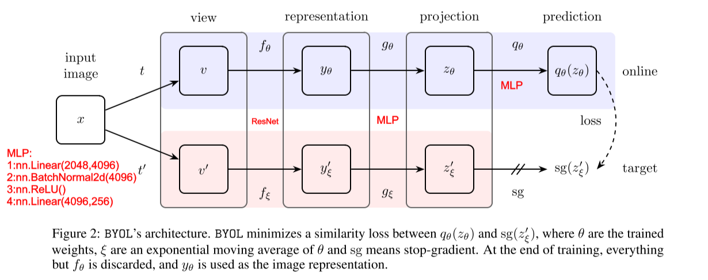

#  Bootstrap Your Own Latent A New Approach to Self-Supervised Learning

Deep Mind

### 1. Method

&emsp;&emsp; **1.1 Architecture：** encoder $f_\theta$ 与 $f_\xi$  : ResNet;

$$
A_{edge,ij} = 1 \ \ \ if\ \ \  A_{ij} > A_{threshold}
$$
