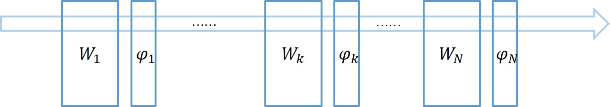
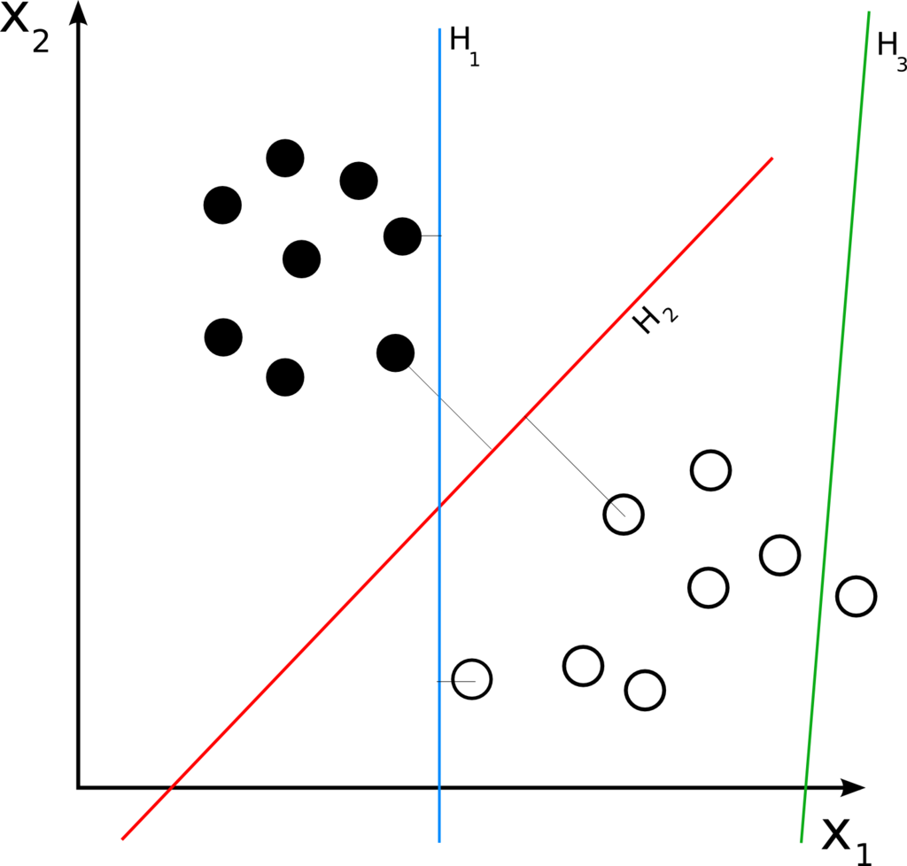
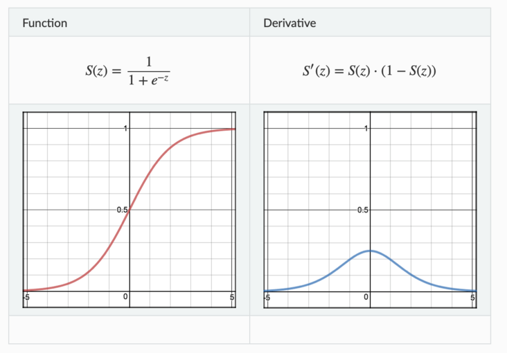

### Batch Normalization

---
#### 1. What is Batch Normalization

\ \ 传统机器学习/统计分析中，一般要对输入的feature/data做scale，常见的方法有：

* 线性归一化(Min-Max Scaling)      
	$$
	\widehat{x}=\frac{x-x_{min}}{x_{max}-x_{min}}
	$$

* 0均值标准化(Z-score standardization) 
	$$
	z=\frac{x-\mu}{\sigma}
	$$

* 直方图均衡化(图像处理)

	受数据预处理启发，在每一中间层输入之前都进行预处理：

 
 

​		Batch Normalization层算法整体分成两步，第一步计算一个Batch中的均值与方差对输入数据做标准化，第二步对标准化数据做scale与shift，即缩放与平移。其中的$\beta$与$\gamma$是通过学习得来的，第二步的原因见3。

#### 2. Why use Batch Normalization

考虑一般网络结构：

​		一次反向传播过程会同时更新所有层的权重，前面层权重的更新会改变当前层输入的分布，而跟据反向传播的计算方式，我们知道，对层权重的更新是在其输入不变的情况下进行的。

​		我们考虑某网络某层，假设其只有两个输入节点，那么对于该层的输出节点相当于一个线性模型$y=w_1x_1+w_2x_2+b$，如下图所示。

​		假定当前输入$x_1$和$x_2$的分布如图中圆点所示，本次更新的方向是将直线$H_1$更新成$H_2$，本以为切分得不错，但是当前面层的权重更新完毕，当前层输入的分布换成了另外一番样子，直线相对输入分布的位置可能变成了$H_3$，下一次更新又要根据新的分布重新调整。直线调整了位置，输入分布又在发生变化，直线再调整位置，就像是直线和分布之间的“追逐游戏”。

​		这种情况对于浅层模型来说影响不大，但对于深层模型，每层的输入分布与权重同时变化，使得训练相当困难，不容易收敛。从而要使用很小的学习率来更新模型参数。

​		按照Batch Normalization原文描述，每层权重的更新是在假定其他权重不变的情况下，向损失函数降低的方向调整自己。问题在于，在一次反向传播过程中，所有的权重会同时更新，导致层间配合“缺乏默契”，每层都在进行上节所说的“追逐游戏”，而且层数越多，相互配合越困难，文中把这个现象称之为 **Internal Covariate Shift**。为了避免过于震荡，学习率不得不设置得足够小，足够小就意味着学习缓慢。

​		除此之外，对于激活函数Sigmoid来说，由于其饱和性，当输入值$x$不在0附近时，其输出的导数很小，网络参数难以得到训练，很容易发生梯度消失，而Batch Normalization将输入数据标准归一化之后使数据在保证本身信息的情况下尽可能落在线性区。
$$
Sigmoid: \ f(x)=\frac{1}{1+e^{-x}}
$$
 

#### 3. Result

结论：BN层加速收敛，泛化能力(test acc)，更高的学习率(w/oBN高的学习率发散不收敛) \

