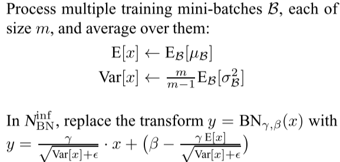

### Batch Normalization

---
#### 1. What is Batch Normalization

&emsp;&emsp;传统机器学习/统计分析中，一般要对输入的feature/data做scale，常见的方法有：

* 线性归一化(Min-Max Scaling)      
$$
\widehat{x}=\frac{x-x_{min}}{x_{max}-x_{min}}
$$

* 0均值标准化(Z-score standardization) 
$$
z=\frac{x-\mu}{\sigma}
$$

* 直方图均衡化(图像处理)

&emsp;&emsp;受数据预处理启发，在每一中间层输入之前都进行预处理：

 

&emsp;&emsp;Batch Normalization层算法整体分成两步，第一步计算一个Batch中的均值与方差对输入数据做标准化，第二步对标准化数据做scale与shift，即缩放与平移。其中的$\beta$与$\gamma$是通过学习得来的。
&emsp;&emsp;Batch Normalization在预测阶段所有参数都是固定值，$\beta$和$\gamma$随着训练结束，两者最终收敛，预测阶段使用训练结束时的值。对于$\mu$和$\sigma$，在训练阶段，它们为当前mini batch的统计量。在预测阶段则采用训练收敛最后几批mini batch的 $\mu$和$\sigma$的期望，作为预测阶段的$\mu$和$\sigma$。

#### 2.Batch Normalization in Conv
&emsp;&emsp; 假设一个卷积层输入的size为[b,c,h,w]，其中b为batch size，c为channel数，h与w为featuremap大小。Batch Normalization按照通道数计算$\mu$与$\sigma$即：
$$
\mu_i = \frac{1}{b\times h\times w}\sum_{b,h,w}Input(b,i,h,w) \in \mathbb{R}^1 \\
\mu = [\mu_1,\mu_2,...,\mu_c] \in \mathbb{R}^c
$$
&emsp;&emsp; 同理$\sigma \in \mathbb{R}^c$。

####  3. Why use Batch Normalization

&emsp;&emsp;考虑一般网络结构：

&emsp;&emsp;一次反向传播过程会同时更新所有层的权重，前面层权重的更新会改变当前层输入的分布，而跟据反向传播的计算方式，我们知道，对层权重的更新是在其输入不变的情况下进行的。

&emsp;&emsp;我们考虑某网络某层，假设其只有两个输入节点，那么对于该层的输出节点相当于一个线性模型$y=w_1x_1+w_2x_2+b$，如下图所示。

&emsp;&emsp;假定当前输入$x_1$和$x_2$的分布如图中圆点所示，本次更新的方向是将直线$H_1$更新成$H_2$，本以为切分得不错，但是当前面层的权重更新完毕，当前层输入的分布换成了另外一番样子，直线相对输入分布的位置可能变成了$H_3$，下一次更新又要根据新的分布重新调整。直线调整了位置，输入分布又在发生变化，直线再调整位置，就像是直线和分布之间的“追逐游戏”。

&emsp;&emsp;这种情况对于浅层模型来说影响不大，但对于深层模型，每层的输入分布与权重同时变化，使得训练相当困难，不容易收敛。从而要使用很小的学习率来更新模型参数。

&emsp;&emsp;按照Batch Normalization原文描述，每层权重的更新是在假定其他权重不变的情况下，向损失函数降低的方向调整自己。问题在于，在一次反向传播过程中，所有的权重会同时更新，导致层间配合“缺乏默契”，每层都在进行上节所说的“追逐游戏”，而且层数越多，相互配合越困难，文中把这个现象称之为 **Internal Covariate Shift**。为了避免过于震荡，学习率不得不设置得足够小，足够小就意味着学习缓慢。

&emsp;&emsp;除此之外，对于激活函数Sigmoid来说，由于其饱和性，当输入值$x$不在0附近时，其输出的导数很小，网络参数难以得到训练，很容易发生梯度消失，而Batch Normalization将输入数据标准归一化之后使数据在保证本身信息的情况下尽可能落在线性区。
$$
Sigmoid: \ f(x)=\frac{1}{1+e^{-x}}
$$
 

#### 4. Result

* 加速训练收敛
* 提高泛化能力(变相添加正则化)
* 适应范围更大的学习率(w/oBN较高的学习率发散不收敛) 
* 防止梯度爆炸/梯度消失
* 依赖Batch Size大小，Batch Size太小时效果不好

#### 5.Why Batch Normalization Work?

待续 + BN backward

#### 6.Q&A

* 为什么需要$\beta$与$\gamma$，即为什么需要scale and shift过程？

&emsp;&emsp;BatchNorm有两个过程，Standardization和scale and shift，前者将mini batch数据进行标准化，而后者则负责恢复数据本身携带的信息，试想没有最后的scale and shift过程，所有batch的输入数据都会被标准化，标准化本身有利于更新权重，因为所有输入的数据分布近乎一致，不标准化有利于保护数据本身分布所携带的信息。**而scale and shift就是在分布与权重之间实现平衡**，考虑$\gamma$=1,$\beta$=0等价于只用Standardization，令$\gamma$=$\sigma$,$\beta$=$\mu$等价于没有BN层，在训练过程中让loss决定什么样的分布是何时的。

* BN层放在ReLU前面还是后面？

&emsp;&emsp;Sigmoid激活函数具有饱和性可能造成梯度消失，那对于具有右饱和性的ReLU激活函数呢来说，BN层放在其前面还是后面。Batch Noralization原文建议将BN层放在ReLU之前，因为ReLU激活函数的输出非负，不能近似为高斯分布。
> &emsp;&emsp;The goal of Batch Normalization is to achieve a stable distribution of activation values throughout training, and in our experiments **we apply it before the nonlinearity since that is where matching the first and second moments is more likely to result in a stable distribution.**

&emsp;&emsp;但在 [caffenet-benchmark](https://github.com/ducha-aiki/caffenet-benchmark#batch-normalization)中，作者基于caffenet在ImageNet上做了对比实验，实验表明，放在前后的差异似乎不大，甚至放在ReLU后还好一些。
|Name|Accuracy|LogLoss|Comments|
|:------|:-----:|:-----:|:-----:|
|Before|0.474|2.35|As in Paper|
|Before+scale&bias layer|0.478|2.33|As in Paper|
|After|**0.499**|**2.21**||
|After+scale&bias layer|0.493|2.24||

---
#### Ref
[Batch Normalization: Accelerating Deep Network Training by Reducing Internal Covariate Shift(arXiv)](https://arxiv.org/abs/1502.03167) 
[How Does Batch Normalization Help Optimization?(NIPS-2018)](https://arxiv.org/abs/1805.11604) 
[Understanding Batch Normalization(NIPS-2018)](https://arxiv.org/abs/1806.02375)
[An Empirical Analysis of theOptimization of Deep Network Loss Surfaces](https://arxiv.org/abs/1612.04010)