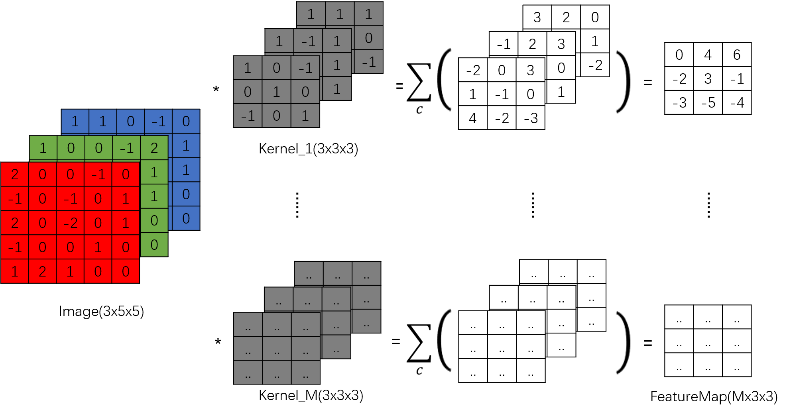

# 卷积

### 1. 卷积

假设输入$Image$是一分辨率为25像素（5x5）的RGB图像，经过 $M$ 个3x3卷积核，得到 $output$

假设卷积核大小为：($c_{out},c_{in},k_h,k_w$)  

卷积核参数量：$c_{out}\cdot c_{in} \cdot k_h \cdot k_w$ + $c_{out}$ (前部分为权重，后部分为偏置)

卷积核运算量：

### Ref
---

[github: conv](https://github.com/vdumoulin/conv_arithmetic/blob/master/README.md#dilated-convolution-animations)

[Pytorch Doc](https://pytorch.org/docs/stable/_modules/torch/nn/modules/conv.html#Conv2d)

