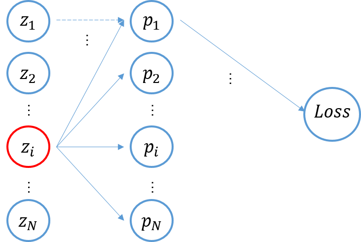
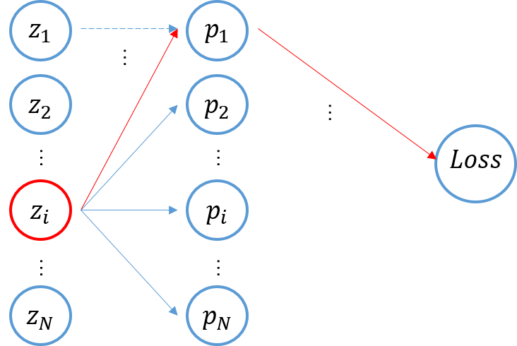

# Entropy and Cross Entropy and Kl divergence

### 熵 Entropy

我们用熵（Entropy）来描述一个系统或一个事件的不确定性。”熵“这一概念本身来自于热力学，香农的信息熵是本文的主要讨论内容。

> 回顾一下概率论，考虑一个随机试验 $E$ ，举例为”抛掷一颗骰子，观察出现的点数“；随机试验 $E$ 所有可能出现的基本事件（基本事件：结果单一不可再分解，每一个基本事件彼此不相容）组成的集合，称为样本空间 $S$ ，对于本例就是，$S=\{1点朝上,2点朝上,...\}$；考虑事件域 $\mathscr{F}$  中的一个元素/事件”骰子点数为偶数“，即$A=\{骰子点数为偶数\}$，用随机变量 $X$ 表示（随机变量），则 $X=\{2, 4, 6\}$；（随机变量是一个实值函数，将一个事件映射为一个值）
>
> https://www.zhihu.com/question/20642770
>
> （后续另辟一章笔记：概率论三要素）

考虑一事件$A$，其对应离散随机变量$X$的取值范围为$\{x_1,x_2,...,x_N\}$,则离散随机变量$X$的信息熵定义如下：
$$
H(X)=-\sum_{i=1}^Np(x_i)\cdot \log p(x_i)
$$
其中$p(\cdot)$表示其中基本事件发生的概率。

无损编码长度的最小长度

### 交叉熵 Cross Entropy 

考虑两个离散概率分布$p,q$​ 交叉熵定义如下：
$$
H(p,q)=-\sum_{x}p(x)\log q(x)
$$
表示用 $q$ 去编码 $p$ ​的冗余编码长度

假定标签分布/真实分布为 $y$​​ ，网络/模型输出 $logits$​​ 经过$softmax$​​处理后分布为 $p(x)$​​ ，则交叉熵计算如下，
$$
\mathcal{L}=H(y,p)=-\sum_{i=1}^Ny_i\log p(x_i)
$$
其中 $softmax$ 处理操作如下，
$$
p(x_i)=\frac{\exp(z_i)}{\sum_{j=1}^{N}\exp(z_j)}
$$
做gradient flow图如下，

接下来我们考虑交叉熵损失函数对$logits$ 的导数：
$$
\frac{\part \mathcal{L}}{\part z_i} = \sum_{j=1}^N \left(\frac{\part \mathcal{L}}{\part p_j} \cdot \frac{\part p_j}{\part z_i}\right)
$$
求和中的子项即计算图中的一条”路径“：

由于 $softmax$ 操作，所有 $p_j$ 都是 $z_i$ 的函数，所以需要求和操作；但由于$softmax$操作，$i,j$ 不同/相同的情况下 $p_j$ 对 $z_i$ 的偏导不一致，当 $i\neq j$ 时有：
$$
\begin{align}
\frac{\part \mathcal{L}}{\part p_j}\cdot \frac{\part p_j}{\part z_i} \bigg|_{i\neq j}&= \frac{\part }{\part p_j}\left[-\sum_{k=1}^Ny_k\log p_k\right]\cdot \frac{\part p_j}{\part z_i} \\
&=-\frac{y_j}{p_j}\cdot \frac{\part p_j}{\part z_i} \\
&=-\frac{y_j}{p_j}\cdot \frac{\part }{\part z_i}\left[\frac{\exp(z_j)}{\sum_{k=1}^{N}\exp(z_k)}\right] \\
&=-\frac{y_j}{p_j}\cdot \frac{\part }{\part z_i}\left[\frac{\exp(z_j)}{\sum_{k\neq i}^{N}\exp(z_k)+\exp(z_i)}\right] \\
&=-\frac{y_j}{p_j}\cdot \left[\frac{-\exp(z_i)\cdot\exp(z_j)}{[\sum_{k=1}^{N}\exp(z_k)]^2}\right] \\
&=-\frac{y_j}{p_j}\cdot \left[-\cdot\frac{\exp(z_i)}{\sum_{k=1}^{N}\exp(z_k)} \cdot \frac{\exp(z_j)}{\sum_{k=1}^{N}\exp(z_k)}\right] \\
&=-\frac{y_j}{p_j}\cdot-p_i\cdot p_j\\
&=y_j \cdot p_i
\end{align}
$$
同理，当 $j=i$ 时，求导如下：
$$
\begin{align}
\frac{\part \mathcal{L}}{\part p_j}\cdot \frac{\part p_j}{\part z_i} \bigg|_{i=j}&= \frac{\part }{\part p_i}\left[-\sum_{k=1}^Ny_i\log p_k\right]\cdot \frac{\part p_i}{\part z_i} \\
&=-\frac{y_i}{p_i}\cdot \frac{\part p_i}{\part z_i} \\
&=-\frac{y_i}{p_i}\cdot \frac{\part }{\part z_i}\left[\frac{\exp(z_i)}{\sum_{k=1}^{N}\exp(z_k)}\right] \\
&=-\frac{y_i}{p_i}\cdot \frac{\part }{\part z_i}\left[\frac{\exp(z_i) }{\sum_{k\neq i}^{N}\exp(z_k)+\exp(z_i)}\right] \\
&=-\frac{y_i}{p_i}\cdot \left[\frac{\exp(z_i)\cdot\sum_{k=1}^N\exp(z_k)-\exp(z_i)\cdot\exp(z_i)}{[\sum_{k=1}^{N}\exp(z_k)]^2}\right] \\
&=-\frac{y_i}{p_i}\cdot \left[\cdot\frac{\exp(z_i)}{\sum_{k=1}^{N}\exp(z_k)} \cdot \frac{\left(\sum_{k=1}^{N}\exp(z_k)\right)-\exp(z_i)}{\sum_{k=1}^{N}\exp(z_k)}\right] \\
&=-\frac{y_i}{p_i}\left[\cdot\frac{\exp(z_i)}{\sum_{k=1}^{N}\exp(z_k)} \cdot \left(1-\frac{\exp(z_i)}{\sum_{k=1}^{N}\exp(z_k)}\right)\right]\\
&=-\frac{y_i}{p_i}\cdot p_i \cdot (1-p_i)\\
&=y_i\cdot (p_i - 1)
\end{align}
$$

考虑公式(5)，则求导改写为：
$$
\begin{align}
\frac{\part \mathcal{L}}{\part p_j}\cdot \frac{\part p_j}{\part z_i}&=\sum_{j\neq i}^N y_j\cdot p_i + y_i\cdot(p_i-1) \\
&=p_i\sum_{j\neq i}^Ny_j + (p_i \cdot y_i - y_i) \\
&=p_i\sum_{j}^Ny_j - y_i \\
&=p_i - y_i
\end{align}
$$

> 那为什么label smooth能work？（从求导角度的一种解释）

label smooth 区别于传统 one-hot的label：
$$
\begin{equation}
y_i=\left\{
\begin{aligned}
& 1-\epsilon\ \ \ \ ,\text{i is true label} \\
& \frac \epsilon {K-1} \ ,\text{otherwise}
\end{aligned}
\right.
\end{equation}
$$
由于$p_i=\frac{\exp(z_i)}{\sum_j\exp(z_j)}$ ，对于one-hot的label来说要求$\exp(z_i)=\sum_{j\neq i} \exp(z_j) + \exp(z_i)$ ，也就是要求$\sum_{j\neq i}\exp(z_j) = 0$ 要求所有不是label对应维度的logits趋近于负无穷，而对于label smooth来说要求$\exp(z_i)=(1-\epsilon)\left[\sum_{j\neq i} \exp(z_j) + \exp(z_i)\right]$, 移项化简有：$\exp(z_i) = \frac{(1-\epsilon)}{\epsilon}\cdot \sum_{j\neq i}\exp(z_j)$；有助于优化（待续）

### KL散度 Kullback-Leibler Divergence

