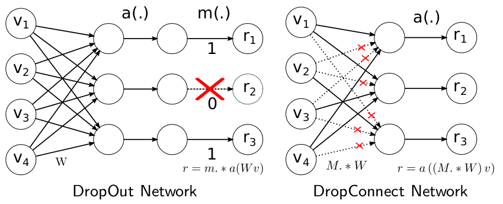
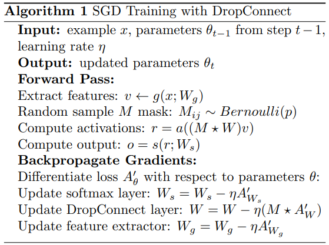
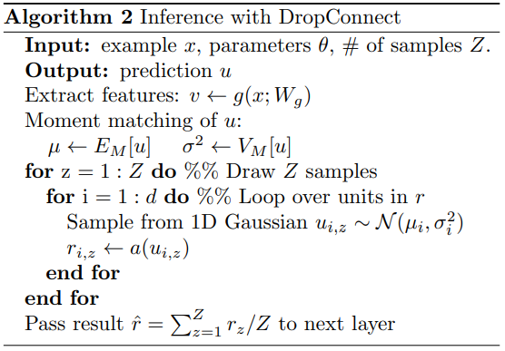
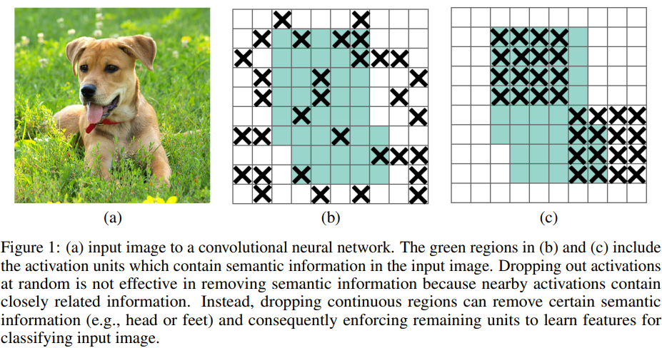
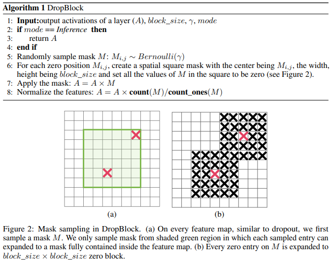
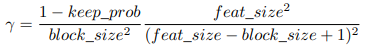

## DropOut & DropConnect & DropPath & DropBlock

#### DropOut

原文：[Dropout: A Simple Way to Prevent Neural Networks from Overfitting](https://jmlr.org/papers/volume15/srivastava14a/srivastava14a.pdf)

```python
import torch
Batch, Dim = 4, 3
input_tensor = torch.rand(Batch, Dim)
print(input_tensor)
# tensor([[0.2656, 0.7749, 0.4836],
#        [0.1392, 0.7476, 0.5573],
#        [0.9275, 0.1819, 0.1483],
#        [0.7094, 0.7102, 0.9078]])

net = torch.nn.Dropout(p=0.5)
net.train()
output_tensor = net(input_tensor)
print(output_tensor)
# tensor([[0.5313, 0.0000, 0.0000],
#        [0.2784, 0.0000, 1.1146],
#        [1.8550, 0.3639, 0.0000],
#        [0.0000, 1.4204, 1.8155]])
net.eval()
output_tensor = net(input_tensor)
print(output_tensor)
# tensor([[0.2656, 0.7749, 0.4836],
#        [0.1392, 0.7476, 0.5573],
#        [0.9275, 0.1819, 0.1483],
#        [0.7094, 0.7102, 0.9078]])
```

训练过程中，每次**输入的特征向量中每个元素**以 $p$ 概率被置零，$1-p$​ 概率正常输出。由于Dropout直接将原向量部分元素置零，为保证最终输出期望一致，正常输出的元素需要乘 $\frac{1}{1-p}$​​​​ 以保证Dropout前后向量期望不变。测试时正常输出向量。

#### DropPath

代码：https://github.com/rwightman/pytorch-image-models/blob/f55c22bebf9d8afc449d317a723231ef72e0d662/timm/models/layers/drop.py#L140

```python
import torch
import torch.nn as nn

def drop_path(x, drop_prob: float = 0., training: bool = False):
    if drop_prob == 0. or not training:
        return x
    keep_prob = 1 - drop_prob
    shape = (x.shape[0],) + (1,) * (x.ndim - 1)  # work with diff dim tensors, not just 2D ConvNets
    '''
    	*tuple can't change*, '+' for tuple means concatenate them. i.e. (3,) + (1,) + (1,) --> (3, 1, 1)
    '''
    random_tensor = keep_prob + torch.rand(shape, dtype=x.dtype, device=x.device)
    '''
    	torch.rand: range from 0.0 to 1.0 (i.e. [0., 1.])
    	keep_prob + torch.rand: range from 0.0 to 1.0 (i.e. [keep_prob, 1 + keep_prob])
    '''
    random_tensor.floor_()  # binarize
    '''
    	tensor.floor_(): 
    	ref:https://pytorch.org/docs/stable/generated/torch.Tensor.floor_.html?highlight=floor_#torch.Tensor.floor_
    	function: returns a new tensor with the floor of elements of input, output would less than or equal to input.
    '''
    output = x.div(keep_prob) * random_tensor
    '''
    	x.div(keep_prob): scale output
    '''
    return output

class DropPath(nn.Module):
    """
    Drop paths (Stochastic Depth) per sample  (when applied in main path of residual blocks).
    """
    def __init__(self, drop_prob=None):
        super(DropPath, self).__init__()
        self.drop_prob = drop_prob

    def forward(self, x):
        return drop_path(x, self.drop_prob, self.training)
```

训练过程中，每个**输入**以 $p$ 概率被置零，$1-p$ 概率正常输出。由于Dropout直接将原向量部分元素置零，为保证最终输出期望一致，正常输出的元素需要乘 $\frac{1}{1-p}$​​ 以保证Dropout前后向量期望不变。测试时正常输出向量。

```python
Batch, Dim = 4, 3
input_tensor = torch.rand(Batch, Dim)
print(input_tensor)
# tensor([[0.5623, 0.0636, 0.7717],
#        [0.9875, 0.6347, 0.5935],
#        [0.9407, 0.7494, 0.0789],
#        [0.3545, 0.5347, 0.1268]])

net = DropPath(p=0.5)
net.train()
output_tensor = net(input_tensor)
print(output_tensor)
#tensor([[1.1246, 0.1271, 1.5435],
#        [1.9750, 1.2694, 1.1869],
#        [0.0000, 0.0000, 0.0000],
#        [0.0000, 0.0000, 0.0000]])
net.eval()
output_tensor = net(input_tensor)
print(output_tensor)
# tensor([[0.5623, 0.0636, 0.7717],
#        [0.9875, 0.6347, 0.5935],
#        [0.9407, 0.7494, 0.0789],
#        [0.3545, 0.5347, 0.1268]])
```

置零的单位为整个向量，区别于Dropout置零单位为向量中的元素。

#### DropConnect

原文：[Regularization of Neural Networks using DropConnect](http://proceedings.mlr.press/v28/wan13.html)

区别于Dropout/DropPath对向量的操作，DropConnect对模型参数进行随机置零操作



原文给出的伪代码：



需要注意：Mask矩阵每个元素为一个伯努利实验（对应Random sample M mask行），其中反向传播中被置零的参数不接受梯度更新（对应Update DropConnect layer行）



测试过程相较于前两者有比较大的不同：直观想法是直接对所有权重rescale参数 $1-p$ ，但原文作者证明这种近似是有问题的，DropConnect使用了如下的方式进行推理：
$$
u \sim \mathcal{N}\left(pWv, p(1-p)(W*W(v*v)\right)
$$
其中 $p$ 为伯努利实验的drop概率，$W$ 为全连接层矩阵， $v$ 为前面特征提取部分，如CNN的结果，$u$​​​ 为推理的结果。

> 源码应该在http://cs.nyu.edu/~wanli/dropc/，但没有权限不得而知，据[某博文](https://www.cnblogs.com/tornadomeet/p/3430312.html)说：源码使用CUDA语言。

#### DropBlock

原文：https://arxiv.org/pdf/1810.12890.pdf

源码：https://github.com/miguelvr/dropblock

DropOut、DropConnect适用于全连接层，对于卷积层不友好，原因在于图像空间特性，被mask掉的临近的像素仍然包含mask部分的语义，Dropout本质相当于引入噪声/舍弃数据，该DropOut的drop分布完全随机，而我们需要针对图像/CNN设计一种结构化的dropout，即DropBlock



原文伪代码：



简单来说，在一定区域内以 $\gamma$​ 概率drop元素，随即以其为中心将其一定领域的元素都置零，其中 $\gamma $​​ 与​Dropout中的 $p$​ 不同，原因在于这一步之后还会mask掉邻域的元素，$\gamma $ 的值通过如下方式进行近似：



小细节是 实验中keep_prob值从1.0线性下降为0.75。

#### Ref

- [Pytorch-Docs-DropOut](https://pytorch.org/docs/stable/generated/torch.nn.Dropout.html?highlight=dropout#torch.nn.Dropout)
- [Dropout & DropPath 源码解析](https://www.cnblogs.com/pprp/p/14815168.html)
- [神经网络Dropout层中为什么dropout后还需要进行rescale](https://www.zhihu.com/question/61751133)
- [Deep learning：四十六(DropConnect简单理解)](https://www.cnblogs.com/tornadomeet/p/3430312.html)
- [正则化方法之DropBlock](https://blog.csdn.net/qq_14845119/article/details/85103503)

