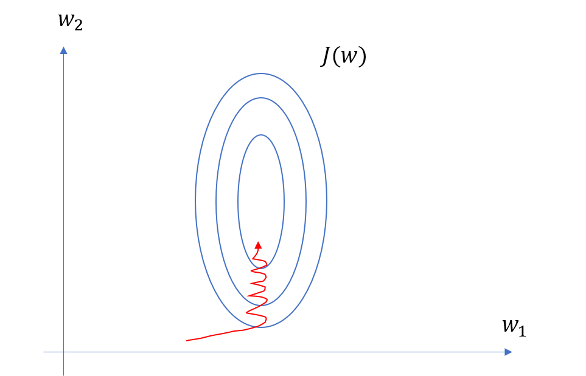

### Why We Need Feature Scaling?

---

A：在很多情况下，我们特征的量纲、量级不同。

考虑一个例子：我们对某地区房屋价格进行预测，我们的特征选择：1、$x_1$ 房屋的面积（$m^2$​）；2、$x_2$​​ 卧室个数。显然房屋面积范围从0到200不等，而卧室个数从0到4、5不等。相互差了两个量级，如果我们要拟合的目标函数为$y=w_0 + w_1\cdot x_1 + w_2\cdot x_2$ 损失函数使用MSE，如果我们不使用特征缩放，那么$w_1$ 的变化对 $y$ 的影响相对于 $w_2$ 来说就更大，同样 $w_1$​ 的梯度也很大，则我们做出损失函数对于模型参数$w$​​的等值线图如下：

而我们梯度更新算法的参数迭代方式为：
$$
w_1=w_1-\eta \cdot \nabla_{w_1}\mathcal{L} \\
w_2=w_2-\eta \cdot \nabla_{w_2}\mathcal{L} \\
$$
可以看出我们对所有的模型参数都使用了同样的学习率，而如果我们不使用特征缩放，$w_1$ 的变化对 $y$ 的影响相对于 $w_2$ 来说就更大，同样 $w_1$​ 的梯度也很大，那么对于模型来说就更难收敛（收敛更慢）。

至此我们有一个更直接的想法：为什么我们不能根据参数量级调整学习率？引出LARS。

