## Batch Normalization

### 1. What is Batch Normalization

&emsp;&emsp;传统机器学习/统计分析中，一般要对输入的feature/data做scale，常见的方法有：

* 线性归一化(Min-Max Scaling)      
$$
\widehat{x}=\frac{x-x_{min}}{x_{max}-x_{min}}
$$

* 0均值标准化(Z-score standardization) 
$$
z=\frac{x-\mu}{\sigma}
$$

* 直方图均衡化(图像处理)

&emsp;&emsp;受数据预处理启发，在每一中间层输入之前都进行预处理：

 

&emsp;&emsp;Batch Normalization层算法整体分成两步，第一步计算一个Batch中的均值与方差对输入数据做标准化，第二步对标准化数据做scale与shift，即缩放与平移。其中的$\beta$与$\gamma$是通过学习得来的。

&emsp;&emsp;Batch Normalization在预测阶段所有参数都是固定值，$\beta$和$\gamma$随着训练结束，两者最终收敛，预测阶段使用训练结束时的值。对于$\mu$和$\sigma$，在训练阶段，它们为当前mini batch的统计量。在预测阶段则采用训练收敛最后几批mini batch的 $\mu$和$\sigma$的期望，作为预测阶段的$\mu$和$\sigma$。

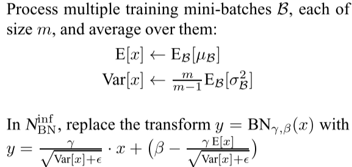

&emsp;&emsp;假如我要预测一个人的健康状况，我们身高，体重，年龄信息，batchsize为10，输入大小为[10, 3]，我们沿着每个特征维度去计算batch里数据的均值和方差，得到身高的均值方差、体重的均值方差、年龄信息的均值方差做归一化。

| 身高 | 体重 | 年龄 |
|:----:|:----:|:----:|
| 150 | 54   | 26   |
| 60  | 18   | 4    |
| 160 | 60   | 48   |
| 177 | 53   | 16   |
| 180  | 60   | 24   |
| 192  | 90   | 22   |
| 172  | 76   | 38   |
| 168  | 83   | 47   |
| 172  | 64   | 17   |
| 180  | 90   | 25   |

&emsp;&emsp;以身高为例，Batch Normalization操作计算均值：

$$
\mu_1 = \frac{1}{10}(150+60+160+177+180+192+172+168+172+180)=161.1
$$

### 2.Batch Normalization in Conv

&emsp;&emsp; 假设一个卷积层输入的size为[b,c,h,w]，其中b为batch size，c为channel数，h与w为featuremap大小。Batch Normalization按照通道数计算$\mu$与$\sigma$即：
$$
\mu_i = \frac{1}{b\times h\times w}\sum_{b,h,w}Input(b,i,h,w) \in \mathbb{R}^1 \\
\mu = [\mu_1,\mu_2,...,\mu_c] \in \mathbb{R}^c
$$

&emsp;&emsp; 同理$\sigma \in \mathbb{R}^c$。

&emsp;&emsp; 对比上一章最后的例子;可以看出，Conv2d的BN操作将Channel视为特征，Channel通道对应的FeatureMap在H，W维度取均值作为该通道的特征值。

###  3. Why use Batch Normalization

&emsp;&emsp;考虑一般网络结构：

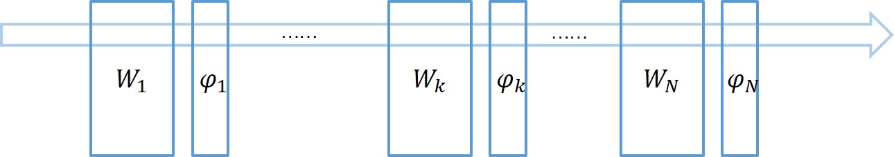

&emsp;&emsp;一次反向传播过程会同时更新所有层的权重，前面层权重的更新会改变当前层输入的分布，而跟据反向传播的计算方式，我们知道，对层权重的更新是在其输入不变的情况下进行的。

&emsp;&emsp;我们考虑某网络某层，假设其只有两个输入节点，那么对于该层的输出节点相当于一个线性模型$y=w_1x_1+w_2x_2+b$，如下图所示。

&emsp;&emsp;假定当前输入$x_1$和$x_2$的分布如图中圆点所示，本次更新的方向是将直线$H_1$更新成$H_2$，本以为切分得不错，但是当前面层的权重更新完毕，当前层输入的分布换成了另外一番样子，直线相对输入分布的位置可能变成了$H_3$，下一次更新又要根据新的分布重新调整。直线调整了位置，输入分布又在发生变化，直线再调整位置，就像是直线和分布之间的“追逐游戏”。

&emsp;&emsp;这种情况对于浅层模型来说影响不大，但对于深层模型，每层的输入分布与权重同时变化，使得训练相当困难，不容易收敛。从而要使用很小的学习率来更新模型参数。

&emsp;&emsp;按照Batch Normalization原文描述，每层权重的更新是在假定其他权重不变的情况下，向损失函数降低的方向调整自己。问题在于，在一次反向传播过程中，所有的权重会同时更新，导致层间配合“缺乏默契”，每层都在进行上节所说的“追逐游戏”，而且层数越多，相互配合越困难，文中把这个现象称之为 **Internal Covariate Shift**。为了避免过于震荡，学习率不得不设置得足够小，足够小就意味着学习缓慢。

&emsp;&emsp;除此之外，对于激活函数Sigmoid来说，由于其饱和性，当输入值$x$不在0附近时，其输出的导数很小，网络参数难以得到训练，很容易发生梯度消失，而Batch Normalization将输入数据标准归一化之后使数据在保证本身信息的情况下尽可能落在线性区。
$$
Sigmoid: \ f(x)=\frac{1}{1+e^{-x}}
$$
 

### 4. Result

* 加速训练收敛
* 提高泛化能力(变相添加正则化)
* 适应范围更大的学习率(w/oBN较高的学习率发散不收敛) 
* 防止梯度爆炸/梯度消失
* 依赖Batch Size大小，Batch Size太小时效果不好

### 5.Why Batch Normalization Work? 

&emsp;&emsp;按照BN原文的解释(本文前3章)，BN减轻了层之间输入的Internal Covariate Shift。但：

* **[How Does Batch Normalization Help Optimization?](https://arxiv.org/abs/1805.11604)**

&emsp;&emsp;**摘要**：文章针对BN原文的ICS假象提出质疑，实验表明，BN层并不能减轻ICS。实际上BN平滑了网络的解空间进而影响优化效率。

&emsp;&emsp;文章设计**实验一**：设计VGG网络，在使用/不使用BN层下在CIFAR10上的效果。

&emsp;&emsp;实验目的：验证BN层是否的确有用？

&emsp;&emsp;实验结果：加入BN层的网络训练更快收敛，能适应更大的学习率，测试集误差低，泛化效果好。文章将某一层的网络参数分布进行可视化，发现两者区别并不明显。从而作者思考：BN层真的会减少ICS？ICS又真的会影响训练效果吗？

&emsp;&emsp;文章设计**实验二**：在BN层之后，在激活函数之前，在每一个时间步给数据增加一个噪音。此举会严重抖动数据，数据分布变得更加杂乱无章，十分不稳定。在每一个时间步，每一个中间层都接受一个**不同**的数据分布。实验结果表明，BN with Noise 与BN表现相差无几。

&emsp;&emsp;实验目的：控制输入数据的均值与方差是否直接关系到训练效果？ICS与训练效果是否有直接联系？

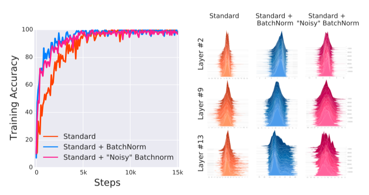

&emsp;&emsp; 其中噪声从一个均值非零，标准差非一的分布中采样得来，而该分布的均值与方差由另一个分布中采样而来。注意在每一个时间步t中，都要重复采样一次。
> &emsp;&emsp;noise sampled from a non-zero mean and non-unit variance distribution. We emphasize that this noise distribution changes at each time step.

&emsp;&emsp;实验结果：Noisy BN 与 Standard BN 训练效果无明显区别，ICS对训练的影响并没有想象得那么大。

&emsp;&emsp;文章设计**实验三**：考虑两个网络，VGG与无激活函数的线性深度网络DLN。定义第$i$层中间层在第$t$次更新时的ICS为$||G_{t,i}-G^{\prime}_{t,i}||_2$，其中：

$$
\begin{align}
&G_{t,i}=\nabla_{W_i^{t}}\mathcal{L}(W_1^{t},...,W_k^{t};x^{t},y^{t}) \\
&G_{t,i}^{\prime}=\nabla_{W_i^{(t)}}\mathcal{L}(W_1^{t+1},...,W_{i-1}^{t+1},W_i^t,..,W_k^t;x^{t},y^{t})
\end{align}
$$

> &emsp;&emsp;$G_{t,i}$ corresponds to the gradient of the layer parameters that would be applied during a simultaneous update of all layers (as is typical). On the other hand, $G^{\prime}_{t,i}$ is the same gradient after all the previous layers have been updated with their new values.

&emsp;&emsp;实验目的：BN真的减弱了ICS？

&emsp;&emsp;注意的是DLN中没有激活函数，等价一个线性映射$Y=AX+b$，“由于没有非线性激活层，那么本应当不出现ICS”（并不是很理解这句话）。

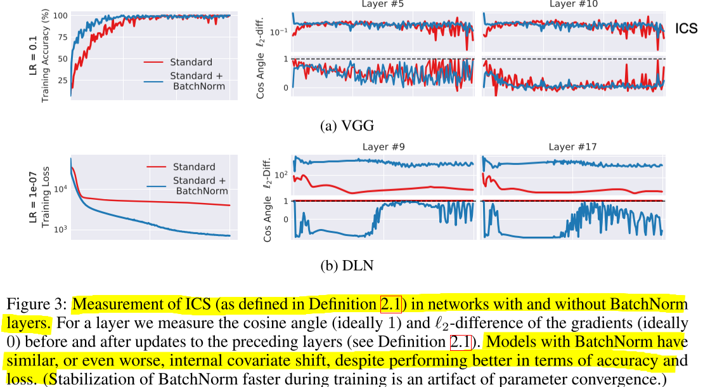
'

&emsp;&emsp;实验结果：从上图左一列可以看出，BN层的确对训练有所帮助，图右两列分别是两个网络中间层的参数空间信息：第一行表示梯度更新前后梯度大小变化的$l_2$距离(即前面定义的ICS)(理想值为0)，第二行表示梯度更新前后梯度方向变化的角度$cos$值(理想之为1，即角度为0)；朴素想法即如果没有严重ICS现象，梯度的每一步应当向同样的方向前进相等的大小，但实验结果表明，对于VGG来说，加入BN层ICS变化不明显，对于DLN来说，加入BN层ICS反而变大。BN层并不能降低ICS，反之，他可能增加中间层ICS。（需要注意的是“梯度”指的是Loss对中间层参数的梯度。）

> &emsp;&emsp;This evidence suggests that, from optimization point of view, controlling the distributions layer inputs as done in BatchNorm, might not even reduce the internal covariate shift.

&emsp;&emsp;**以上实验都表明了，BN层的确work，能够帮助训练，但ICS与训练效果无关，BN层并不能降低ICS。**那么，BN层到底是如何优化训练的？

> &emsp;&emsp;Indeed, we identify the key impact that BatchNorm has on the training process: it reparametrizes the underlying optimization problem to make its landscape significantly more smooth.
> &emsp;&emsp;The loss changes at a smaller rate and the magnitudes of the gradients are smaller too 

&emsp;&emsp;介绍俩个新的概念：

&emsp;&emsp;**1. 利普希茨常数$\mathcal{L}$**

&emsp;&emsp;&emsp;&emsp;对于函数 $f$ 若存在常数 $L$ 使得对于$\forall x_1,x_2 \in D$有$|f(x_1)-f(x_2)| \leq L|x_1 - x_2|$，则称 $f$ 符合利普希茨条件，对于 $f$ 最小的常数 $L$ 称为 $f$ 的**利普希茨常数**。

&emsp;&emsp;&emsp;&emsp;通俗来说，L-Lipschitz限制了函数的变化速度，符合利普希茨条件的函数斜率一定小于一个实数，即利普希茨常数。$x$ 变化一定量，函数相应变化的量不能非常大。再简单点说就是函数一阶导数要小于一定值。

&emsp;&emsp;**2. $\beta$-smoothness**

&emsp;&emsp;&emsp;&emsp;简单来说，$\beta$-smoothness就是对函数梯度的一阶导数进行限制。见公式：

$$
||\nabla f(x_1) - \nabla f(x_2)|| \leq \beta ||x_1 - x_2||
$$

&emsp;&emsp;原文认为BN使得loss landscape更加光滑。试想没有BN层之前的vanil DNN，损失函数不仅非凸，且存在大量“扭结”，平坦区域，尖锐的极小值。显然这会导致难以优化，优化不稳定。

> &emsp;&emsp;the loss function is not only non-convex but also tends to have a large number of “kinks”, flat regions, and sharp minima.

&emsp;&emsp;BN层使得loss landscape更加平滑（见原文👇）

> &emsp;&emsp;After all, improved Lipschitzness of the gradients gives us confidence that when we take a larger step in a direction of a computed gradient, this gradient direction remains a fairly accurate estimate of the actual gradient direction after taking that step.

&emsp;&emsp;这也就意味着我们能够用更大的学习率而不必担心最优的loss方向突然变化导致不稳定。

> &emsp;&emsp;It thus enables any (gradient–based) training algorithm to take larger steps without the danger of running into a sudden change of the loss landscape such as flat region (corresponding to vanishing gradient) or sharp local minimum (causing exploding gradients).

&emsp;&emsp;为了验证这个说法，文章设计在with BN 与without BN的情况下对VGG网络进行训练。

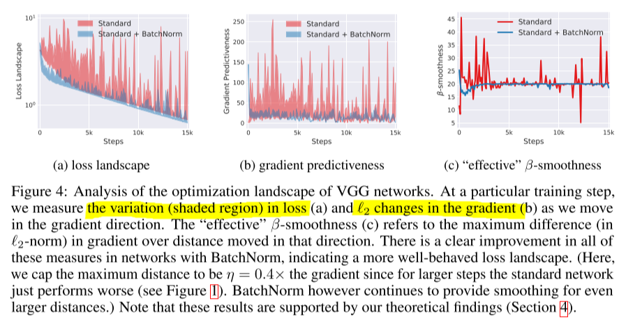

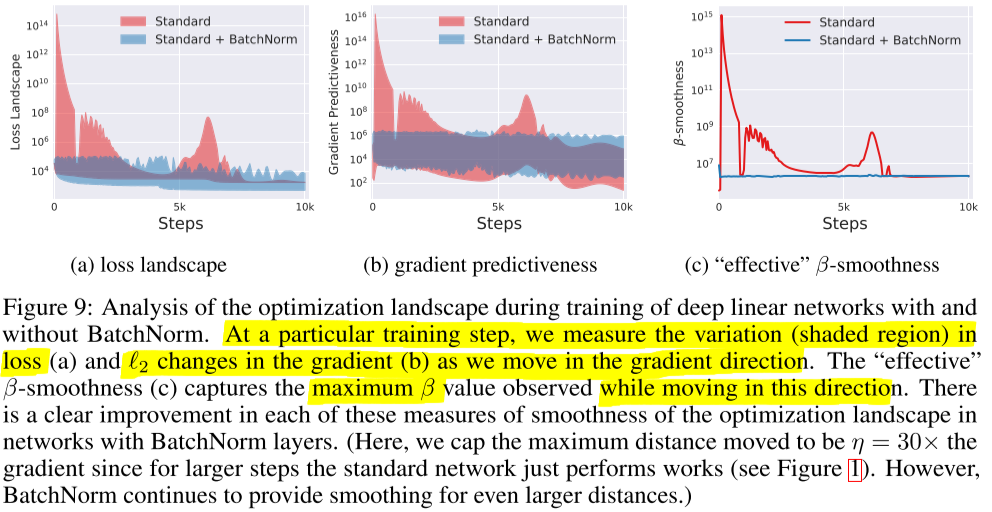

&emsp;&emsp;fig(a)：在训练中的每一个step，计算当前step损失函数的方向，沿着这个方向走下去的loss变化范围；注意图中不是曲线。

> &emsp;&emsp;To demonstrate the impact of BatchNorm on the stability of the loss itself, i.e., its Lipschitzness, for each given step in the training process, we compute the gradient of the loss at that step and measure how the loss changes as we move in that direction – see Figure 4(a)

&emsp;&emsp;fig(b)：训练过程中某点的损失函数梯度，与上一个梯度方向不同的点的L2距离变化。

> &emsp;&emsp;Similarly, to illustrate the increase in the stability and predictiveness of the gradients, we make analogous measurements for the $l_2$ distance between the loss gradient at a given point of the training and the gradients corresponding to different points along the original gradient direction.

&emsp;&emsp;fig(c)：沿着梯度方向上，梯度的 $\beta$ 常数范围。

> &emsp;&emsp;To further demonstrate the effect of BatchNorm on the stability/Lipschitzness of the gradients of the loss, we plot in Figure 4(c) the “effective” β-smoothness of the vanilla and BatchNorm networks throughout the training. (“Effective” refers here to measuring the change of gradients as we move in the direction of the gradients.).

&emsp;&emsp;针对之前的实验三，有没有BN层对VGG来说，ICS指标变化不大，也就是说两者的参数更新前后梯度L2变化不大，角度变化的区别不大。withoutBN的损失函数陡峭不规则（下图左），造成他的梯度要来回变化，那按照这里的解释，withBN的损失函数平滑许多（下图右），那为什么他的梯度大小还要来回变化，方向来回变化？梯度方向不应该变化比较小吗？

&emsp;&emsp;猜测可能是它是“螺旋”下降，虽然“绝对”方向在变，但相对来说都是向下的，不像左图一样会跳出该点跑到别的地方？

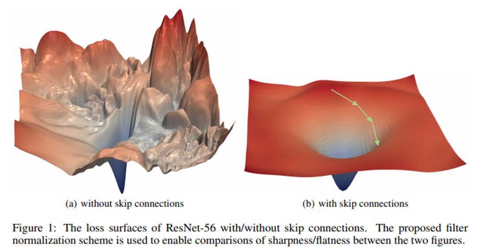

&emsp;&emsp;那是否只有Batch Normalization一种方法优化损失函数空间/或是Batch Normalization就是最好的？文章用 $L_p$ 正则化代替BN也达到了类似的效果。

&emsp;&emsp;**理论分析**，原文考虑一个Vanilla Network与Vanilla Network + BatchNorm Layer的损失函数区别。最终得出，加入BN层之后，损失函数梯度有一个相应的上界（L-Lipschitzness）即损失函数更加利普希兹，引入了 BN 后，损失函数相对于激活函数值的二阶项幅值更小，也即损失函数更加贝塔平滑。

* **[Understanding Batch Normalization(NIPS-2018)](https://arxiv.org/abs/1806.02375)**

&emsp;&emsp;**摘要**:XXXXXXXX

&emsp;&emsp;**第一节**设计实验验证BN层到底有没有用？Resnet110+SGD

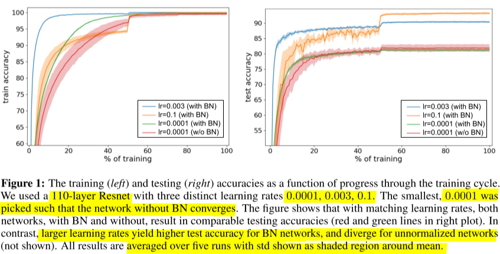

&emsp;&emsp;实验结果也表明了BN层的确对训练有所帮助，更高的学习率，更快收敛，泛化能力好。

&emsp;&emsp;**第二节**针对SGD模型考虑经验化的理论分析：

&emsp;&emsp;损失函数有$\ell (x)=\frac{1}{N} \sum_{i=1}^{N}\ell _i(x)$，按照当下batch-SGD算法，考虑batch下集合$B$为数据集一个子集，学习率$\alpha$，则每一步梯度更新$\alpha \nabla_{SGD}(x) = \frac{\alpha}{|B|} \sum_{i \in B} \nabla \ell _i(x)$。对该式做简单加减有：

$$
\alpha \nabla_{SGD}(x) = \underbrace{ \alpha \nabla \ell (x) }_{gradient} + \underbrace{\frac{\alpha}{|B|}\sum_{i \in B}(\nabla \ell _i(x) - \nabla \ell (x))}_{error\ term}
$$

&emsp;&emsp;考虑到前部分为原本梯度更新大小，后半部分为误差项，由于我们只在一个batch种做求和平均操作，所以一定程度上，梯度的更新与true gradient有一定误差，相当于引入了噪音。由于我们batch对数据集均匀采样，所以我们对梯度的估计为无偏估计，即：

$$
\mathbb{E}[\frac{\alpha}{|B|}\sum_{i \in B}(\nabla \ell _i(x) - \nabla \ell (x))]=0
$$

&emsp;&emsp;取噪声部分为$C=\mathbb{E}[||\nabla \ell _i (x) - \nabla \ell  (x)||^2]$，附录D，可推出上界：
$$
\mathbb{E}[||\alpha \nabla \ell (x) - \alpha \nabla_{SGD}(x)||^2] \leq \frac{\alpha ^2}{|B|}C
$$

&emsp;&emsp;从这个上界可以看出，学习率越大，batch size越小，SGD梯度上界就越大，梯度更有可能跳到“更远”的地方，也就相应泛化能力更好。

> &emsp;&emsp; it is empirically demonstrated that large mini-batches lead to convergence in sharp minima, which often generalize poorly. 
> &emsp;&emsp;The intuition is that larger SGD noise from smaller mini-batches prevents the network from getting “trapped” in sharp minima and therefore bias it towards wider minima with better generalization. Our observation implies that SGD noise is similarly affected by the learning rate as by the inverse mini-bath size, suggesting that a higher learning rate would similarly bias the network towards wider minima.

&emsp;&emsp;那么Batch Normalization又是如何影响学习率，使得高的学习率不会发散？

&emsp;&emsp;由于在大的学习率下，without BN网络在最初几个step很容易发散，所以文章选择最初的梯度幅度分布。具体而言，原文选择最开始的第55层卷积核的梯度幅值分布。

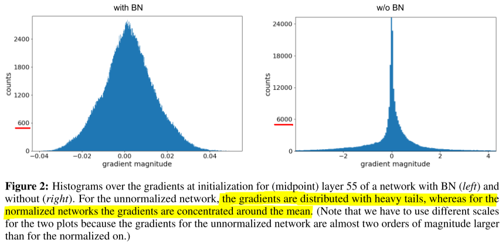

&emsp;&emsp;除此之外，考虑沿着梯度方向的relative loss(i.e. new_loss/old_loss)随着step-size变化的曲线如下。

> &emsp;&emsp;A natural way of investigating divergence is to look at the loss landscape along the gradient direction during the first few mini-batches that occur with the normal learning rate (0.1 with BN, 0.0001without).

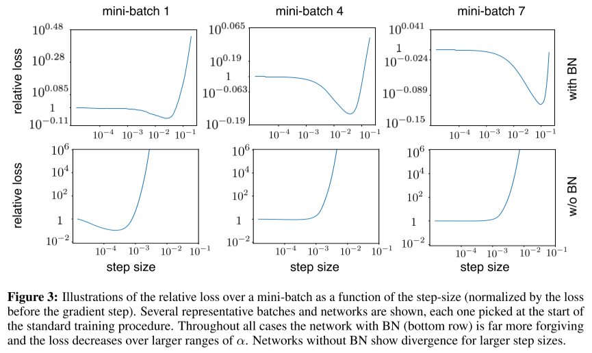

&emsp;&emsp;从图中可以看出，随着step-size增大， with BN的relative loss在很大范围内都控制在1以下或附近，而w/o BN很容易远远比1大，很容易高出两个量级。（如果relative loss 很大，说明网络“迈出”这一步之后loss明显比上一步要大，说明很容易发散。）

&emsp;&emsp;原文考虑without BN网络中间层激活输出的均值与方差变化。其中颜色条指后一层的输出与前一层输出的比值。从图中可以看出，随着step进行，模型发散，均值逐渐偏移，方差逐渐增大，也就是说输出“爆炸”。层数越深的输出，“爆炸”现象明显。

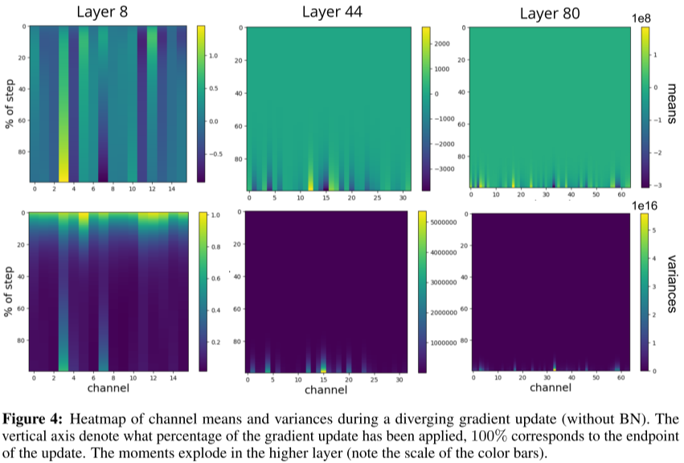

> &emsp;&emsp;The color bar reveals that the scale of the later layer’s activations and variances is orders of magnitudes higher than the earlier layer. This seems to suggest that the divergence is caused by activations growing progressively larger with network depth, with the network output “exploding” which results in a diverging loss. BN successfully mitigates this phenomenon by correcting the activations of each channel and each layer to zero-mean and unit standard deviation, which ensures that large activations in lower levels cannot propagate uncontrollably upwards.

&emsp;&emsp;另一个实验数据：

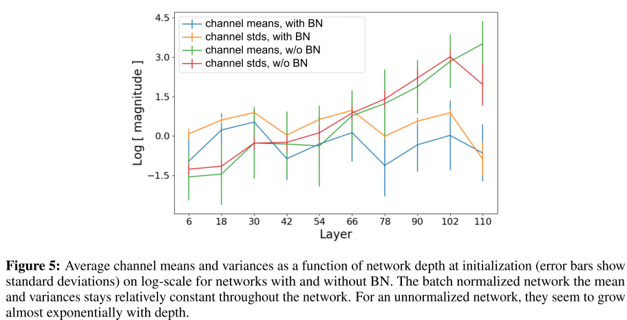

&emsp;&emsp;至此所做的实验，我们可得出结论：1，大的学习率，模型“迈”得越远，更容易跳出sharp minima。（但loss landscape如果不平坦，“迈”得越远，越不容易收敛）2，w/o BN相比于with BN的梯度更新步长范围太广。（Figure 2.）3，BN层会使得loss landscape更加平坦，在同样远的范围内，with BN的梯度变化不大。4，w/o BN会导致数据分布逐渐变化，均值偏移，方差变大。（不知道这样算不算ICS的一种论据，结合上一篇，w/o BN 数据ICS，但ICS不会影响训练，BN层反而增大ICS。）

* **[An Empirical Analysis of theOptimization of Deep Network Loss Surfaces](https://arxiv.org/abs/1612.04010)**

待续 + BN backward

### 6.Q&A

* 为什么需要$\beta$与$\gamma$，即为什么需要scale and shift过程？

&emsp;&emsp;BatchNorm有两个过程，Standardization和scale and shift，前者将mini batch数据进行标准化，而后者则负责恢复数据本身携带的信息，试想没有最后的scale and shift过程，所有batch的输入数据都会被标准化，标准化本身有利于更新权重，因为所有输入的数据分布近乎一致，不标准化有利于保护数据本身分布所携带的信息。**而scale and shift就是在分布与权重之间实现平衡**，考虑$\gamma$=1,$\beta$=0等价于只用Standardization，令$\gamma$=$\sigma$,$\beta$=$\mu$等价于没有BN层，在训练过程中让loss决定什么样的分布是合适的。

* BN层放在ReLU前面还是后面？

&emsp;&emsp;Sigmoid激活函数具有饱和性可能造成梯度消失，那对于具有右饱和性的ReLU激活函数呢来说，BN层放在其前面还是后面。Batch Noralization原文建议将BN层放在ReLU之前，因为ReLU激活函数的输出非负，不能近似为高斯分布。
> &emsp;&emsp;The goal of Batch Normalization is to achieve a stable distribution of activation values throughout training, and in our experiments **we apply it before the nonlinearity since that is where matching the first and second moments is more likely to result in a stable distribution.**

&emsp;&emsp;但在 [caffenet-benchmark](https://github.com/ducha-aiki/caffenet-benchmark#batch-normalization)中，作者基于caffenet在ImageNet上做了对比实验，实验表明，放在前后的差异似乎不大，甚至放在ReLU后还好一些。
|Name|Accuracy|LogLoss|Comments|
|:------|:-----:|:-----:|:-----:|
|Before|0.474|2.35|As in Paper|
|Before+scale&bias layer|0.478|2.33|As in Paper|
|After|**0.499**|**2.21**||
|After+scale&bias layer|0.493|2.24||

---
### Ref

* [Batch Normalization: Accelerating Deep Network Training by Reducing Internal Covariate Shift(arXiv)](https://arxiv.org/abs/1502.03167) 

* [How Does Batch Normalization Help Optimization?(NIPS-2018)](https://arxiv.org/abs/1805.11604) 

* [Understanding Batch Normalization(NIPS-2018)](https://arxiv.org/abs/1806.02375)

* [An Empirical Analysis of theOptimization of Deep Network Loss Surfaces](https://arxiv.org/abs/1612.04010)

* [The Gradient Flow through the Batch Normalization Layer](https://kratzert.github.io/2016/02/12/understanding-the-gradient-flow-through-the-batch-normalization-layer.html)

* [《How Does Batch Normalization Help Optimization》笔记——CapsulE](https://zhuanlan.zhihu.com/p/72912402)

* [论文|How Does Batch Normalizetion Help Optimization——Estyle](https://zhuanlan.zhihu.com/p/66683061)

* [How Does Batch Normalization Help Optimization?——cnblogs](https://www.cnblogs.com/seniusen/p/10795297.html)