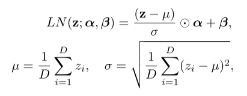

## Layer Normalization

### 1. Why we need Layer Normalization

&emsp;&emsp;实验证明，Batch Normalization可以加速收敛，使用更大的学习率，拥有一定的正则化效果；但：

* Batch Normalization 依赖 Batch Size，在Batch Size很小的情况下，Batch统计数据不能反应整体统计情况，Batch Normalization效果很差

* Batch Normalization 要求训练时保存中间层的running mean等统计数据用于测试，要求网络深度固定/静态网络，对于RNN/动态网络不适用。

&emsp;&emsp;对于RNN来说如何做Normalization？--> Layer Normalization

### 2. What is Layer Normalization

&emsp;&emsp;仿BN操作，LN操作分为两步，第一步对数据做标准化，第二步对标准化后的数据做scale与shift。

&emsp;&emsp;其中 $D$ 为网络隐藏层神经元数量。$z^l_i$ 为第 $l$ 隐藏层中第 $i$ 个神经元的数值。 $\odot$ 表示哈达玛积，即向量/矩阵对应元素相乘。

&emsp;&emsp; 依然考虑Batch Normalization中的例子，我们考虑一个Batch Size为10的数据，每个数据有三个特征：身高，体重，年龄。

| 身高 | 体重 | 年龄 |
|:----:|:----:|:----:|
| 150 | 54   | 26   |
| 60  | 18   | 4    |
| 160 | 60   | 48   |
| 177 | 53   | 16   |
| 180  | 60   | 24   |
| 192  | 90   | 22   |
| 172  | 76   | 38   |
| 168  | 83   | 47   |
| 172  | 64   | 17   |
| 180  | 90   | 25   |

&emsp;&emsp;LN操作与BN操作不同，三个维度，三个神经元，以第一个数据为例，LN操作的均值计算为：
$$
\mu_1=\frac{1}{3}(150+54+26)=76.7
$$

&emsp;&emsp;LN对于RNN网络效果较好，故在NLP任务中应用较广。