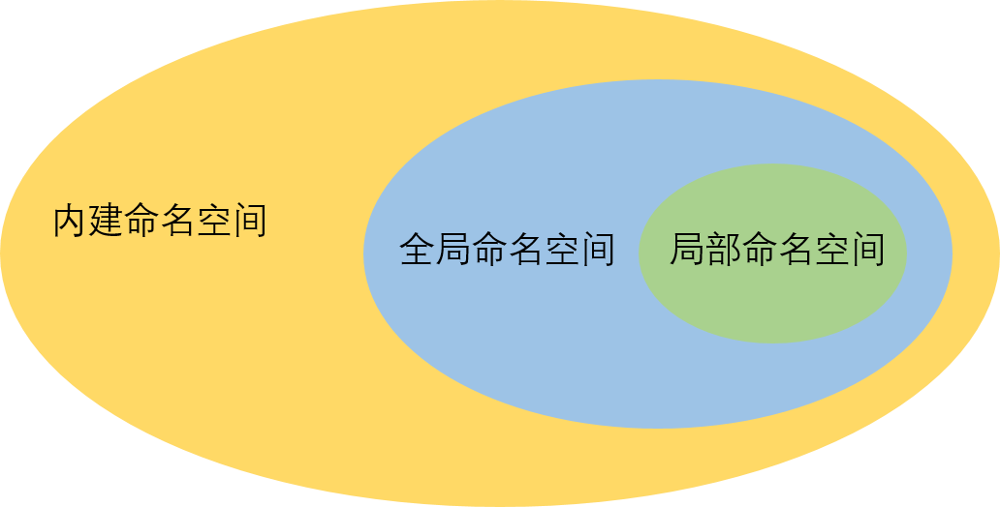

### 1、命名空间&作用域

概括：**一个变量处在哪个命名空间则决定了它的作用域，而它的作用域则表示了它的作用范围与被引用时所查找的顺序优先级。**

- 本地命名空间Local Namespace：函数/类中定义的命名，包括函数的参数
- 全局命名空间Global Namespace：当前模块中的命名，与其他模块中import进来的命名
- 内置命名空间Built-in Namespace：指Python语言内置的命名，如：\__name__, print, type 等关键字

```python
a = 1 # a:全局命名空间

def func():
    b = 2 # b:局部命名空间

print(__name__)  # __name__:内建命名空间
```

#### 1.1、内建命名空间

Python的内建命名都在\_\_builtins\_\_ 模块中，可以使用`dir()`函数返回\_\_builtins\_\_中的变量、方法等

```python
print(dir(__builtins__))

# ['ArithmeticError', 'AssertionError', 'AttributeError', 'BaseException', 'BlockingIOError', 'BrokenPipeError', 'BufferError', 'BytesWarning', 'ChildProcessError', 'ConnectionAbortedError', 'ConnectionError', 'ConnectionRefusedError', 'ConnectionResetError', 'DeprecationWarning', 'EOFError', 'Ellipsis', 'EnvironmentError', 'Exception', 'False', 'FileExistsError', 'FileNotFoundError', 'FloatingPointError', 'FutureWarning', 'GeneratorExit', 'IOError', 'ImportError', 'ImportWarning', 'IndentationError', 'IndexError', 'InterruptedError', 'IsADirectoryError', 'KeyError', 'KeyboardInterrupt', 'LookupError', 'MemoryError', 'ModuleNotFoundError', 'NameError', 'None', 'NotADirectoryError', 'NotImplemented', 'NotImplementedError', 'OSError', 'OverflowError', 'PendingDeprecationWarning', 'PermissionError', 'ProcessLookupError', 'RecursionError', 'ReferenceError', 'ResourceWarning', 'RuntimeError', 'RuntimeWarning', 'StopAsyncIteration', 'StopIteration', 'SyntaxError', 'SyntaxWarning', 'SystemError', 'SystemExit', 'TabError', 'TimeoutError', 'True', 'TypeError', 'UnboundLocalError', 'UnicodeDecodeError', 'UnicodeEncodeError', 'UnicodeError', 'UnicodeTranslateError', 'UnicodeWarning', 'UserWarning', 'ValueError', 'Warning', 'WindowsError', 'ZeroDivisionError', '__build_class__', '__debug__', '__doc__', '__import__', '__loader__', '__name__', '__package__', '__spec__', 'abs', 'all', 'any', 'ascii', 'bin', 'bool', 'breakpoint', 'bytearray', 'bytes', 'callable', 'chr', 'classmethod', 'compile', 'complex', 'copyright', 'credits', 'delattr', 'dict', 'dir', 'divmod', 'enumerate', 'eval', 'exec', 'exit', 'filter', 'float', 'format', 'frozenset', 'getattr', 'globals', 'hasattr', 'hash', 'help', 'hex', 'id', 'input', 'int', 'isinstance', 'issubclass', 'iter', 'len', 'license', 'list', 'locals', 'map', 'max', 'memoryview', 'min', 'next', 'object', 'oct', 'open', 'ord', 'pow', 'print', 'property', 'quit', 'range', 'repr', 'reversed', 'round', 'set', 'setattr', 'slice', 'sorted', 'staticmethod', 'str', 'sum', 'super', 'tuple', 'type', 'vars', 'zip']
```

可以看到常见的`int()`函数、`type()`函数、`print()`函数等等。

#### 1.2、全局命名空间

在模块最外层定义的变量、方法、类等会定义在全局命名空间中。可以使用`globals()`函数，返回当前全局命名空间中的变量、方法等。

```python
a = 1
print(globals())

# {'__name__': '__main__', '__doc__': None, '__package__': None, '__loader__': <_frozen_importlib_external.SourceFileLoader object at 0x0000024D188DD4C0>, '__spec__': None, '__annotations__': {}, '__builtins__': <module 'builtins' (built-in)>, '__file__': 'D:/PythonCode/testcode/test.py', '__cached__': None, 'a': 1}

```

可以看到除了`a=1`是我们定义的之外，模块本身所有的一些全局变量。如果我们引入一些第三方模块。

```python
{'__name__': '__main__', '__doc__': None, '__package__': None, '__loader__': <_frozen_importlib_external.SourceFileLoader object at 0x0000027E2333D4C0>, '__spec__': None, '__annotations__': {}, '__builtins__': <module 'builtins' (built-in)>, '__file__': 'D:/PythonCode/testcode/test.py', '__cached__': None, 'math': <module 'math' (built-in)>, 'a': 1}

# {'__name__': '__main__', '__doc__': None, '__package__': None, '__loader__': <_frozen_importlib_external.SourceFileLoader object at 0x0000027E2333D4C0>, '__spec__': None, '__annotations__': {}, '__builtins__': <module 'builtins' (built-in)>, '__file__': 'D:/PythonCode/testcode/test.py', '__cached__': None, 'math': <module 'math' (built-in)>, 'a': 1}
```

可以看到，引入的第三方模块也在全局命名空间中。

#### 1.3、局部命名空间

在函数体、类中的命名。可以使用`locals()`函数，返回当前局部命名空间中的变量、方法等。

```python
a = 1

def func():
    b = 2
    print('variable in func():', locals())

def func2():
    b = 3
    print('variable in func2():', locals())

func()
func2()

# variable in func(): {'b': 2}
# variable in func2(): {'b': 3}
```

可以看出`func()` 与`func2()` 的命名空间不一样，`locals()`函数也只是返回，`locals()`函数所在空间的变量等。

> 命名空间可以理解为Windows中的文件夹



#### 1.4、作用域

作用域则指变量所作用的范围，比如下面这段代码：

```python
a = 1 
def func():
    a = 2
    print(a)
func()
print(a)

# 2
# 1
```

函数体中的 `a` 处于局部命名空间，那么它的作用域就只作用在 `func()` 这个函数中，当我们在`func`函数的空间中使用`print`函数调用 `a` 时，优先调用函数体中的 `a` ，所以为2。

举一个例子：某人身处A公司全球事业部（命名空间），他的职能范围就是全球市场（作用域）；某人身处A公司北京事业部，那他的职责范围就是北京市场。当你在北京购买A公司的产品有问题，你上报时只上报到北京事业部，而不会是全球事业部。

> 作用域越小的变量，优先级越高

如果我们在局部命名空间想要使用并更改全局的变量，使用`global`

