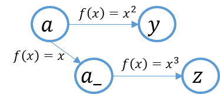

---

**1、**区分Pytorch中**clone**、**detach**、**copy**等张量复制操作

1.1、tensor.clone()

返回一个和源张量同`shape`，`dtype` ， `device` 的张量，与源张量**不共享数据内存**，但提供**梯度回溯**。

举个例子：

```python
import torch
a = torch.tensor(1.0, requires_grad=True, device="cuda", dtype=torch.float64)
a_ = a.clone()  
#  tensor(1., device='cuda:0', dtype=torch.float64, grad_fn=<CloneBackward>)
#  grad_fn=<CloneBackward>，说明clone后的返回值是个中间variable，因此支持梯度的回溯。因此，clone操作在一定程度上可以视为是一个identity-mapping函数。
y = a ** 2
y.backward()
print(a.grad)  # 2
z = a_ ** 3
z.backward()
print(a_grad)  # None. 中间Variable不保存梯度
print(a.grad)  # 2 + 3 = 5
```



从上图可以看出clone之后的a_可以理解成给a额外做的一个identity映射，两者不共享内存，是完全不同的两个张量，但由于identity-mapping，所以梯度存在回溯。

1.2、tensor.detach()

同样会返回一个和源张量同`shape`，`dtype` ， `device` 的张量，但与源张量**共享数据内存**，但不提供梯度，即`requires_grad=False`。

举个例子：

```python
import torch
a = torch.tensor(1.0, requires_grad=True, device='cpu', dtype=torch.float32)
a_ = a.detach()
print(a_)  # tensor(1.) 

y = a ** 2
y.backward()
print(a.grad)  # tensor(2.)  grad = 2 * a = 2 * 1 = 2
a_.requires_grad_()
z = a_ ** 3
z.backward()
print(a_.grad)  # tensor(3.)  grad = 3 * a_ = 3 * 1 = 3
print(" a ", a.grad)  # tensor(2.)  grad = 2 * a = 2 * 1 = 2 

# 改变a_的data值， a的data值也相应改变
a_.item = 2
z = a_ ** 3
z.backward()
print(a_.grad)  # tensor(6.)  grad = 3 * a_ = 3 * 2 = 6
y = a ** 2
y.backward()
print(a.grad)  # tensor(4.)  grad = 2 * a = 2 * 2 = 4 
```

detach可以看作，单纯取出原tensor的data部分，但不具备梯度，两者共享内存。

> 通常我们将detach与clone联合使用，分离出计算图中的节点数据，使其与源数据即不共享内存，也不存在梯度。`a_data = a.clone().detach()`

---

**torch.chunk(input: Tensor, chunk: int, dim: int =0) -> List of Tensors** 

**Tensor.chunk(chunks: Tensor, dim: int=0) -> List of Tensors** 

Splits a tensor into a specific number of chunks.(Last chunk will be smaller if the tensor size along the given dimension `dim` is not divisible by `chunks`, would be null.)

```python
>>>torch.chunk(torch.arange(8), chunks=2, dim=-1)
>>>(tensor([0, 1, 2, 3]), tensor([4, 5, 6, 7]))
```
```python
>>>torch.chunk(torch.arange(8), chunks=3, dim=-1)
>>>(tensor([0, 1, 2]), tensor([3, 4, 5]), tensor([6, 7]))
```
```python
>>>a = torch.arange(8).view(2, 4)
>>>tensor([[0, 1, 2, 3],
          [4, 5, 6, 7]])
>>>torch.chunk(a, chunks=3, dim=0)
>>>(tensor([[0, 1],
          [4, 5]]),
   tensor([[2, 3],
          [6, 7]]))
>>>torch.chunk(a, chunks=2, dim=0)
>>>(tensor([[0, 1],
          [4, 5]]),
   tensor([[2, 3],
          [6, 7]]))
'''
LAST CHUNK COULD BE NULL
'''
```

**torch.split(tensor: Tensor, split_size_or_sections: int/List[int], dim: int=0)**

**Tensor.split(split_size, dim: int=0)**

Splits the tensor into chunks. 

If `split_size_or_sections` is an integer type, then [`tensor`](https://pytorch.org/docs/stable/generated/torch.tensor.html#torch.tensor) will be split into equally sized chunks (if possible) the same as torch.chunk().

If `split_size_or_sections` is a list, then [`tensor`](https://pytorch.org/docs/stable/generated/torch.tensor.html#torch.tensor) will be split into `len(split_size_or_sections)` chunks with sizes in `dim` according to `split_size_or_sections`.

```python
>>> a = torch.arange(10).reshape(5,2)
>>> a
tensor([[0, 1],
        [2, 3],
        [4, 5],
        [6, 7],
        [8, 9]])
>>> torch.split(a, 2)
(tensor([[0, 1],
         [2, 3]]),
 tensor([[4, 5],
         [6, 7]]),
 tensor([[8, 9]]))
>>> torch.split(a, [1,4])
(tensor([[0, 1]]),
 tensor([[2, 3],
         [4, 5],
         [6, 7],
         [8, 9]]))
```

**torch.unbind(input: Tensor,dim: int=0) -> seq** 

**Tensor.unbind(input: Tensor, dim: int=0) -> seq** 

Remove a tensor dimension and return as a list of Tensors.

```python
>>>torch.unbind(torch.tensor([[1,2,3],
                             [4,5,6],
                             [7,8,9]]))
>>>(tensor([1,2,3]),tensor([4,5,6]),tensor([7,8,9]))
```

```python
>>>a = torch.arange(8).view(2,2,2)
>>>tensor([
    	  [[0, 1],
           [2, 3]],
          [[4, 5],
           [6, 7]]
		 ])
>>>torch.unbind(a,dim=0)
>>>(tensor([[0, 1],
           [2, 3]]), 
   tensor([[4, 5],
           [6, 7]]))
```

**torch.Tensor.repeat(\*size) -> Tensor**

repeat this tensor along each dimension

```python
>>>x = torch.tensor([1,2,3])
>>>x.repeat(4,2)
tensor([[1,2,3,1,2,3],
        [1,2,3,1,2,3],
        [1,2,3,1,2,3],
        [1,2,3,1,2,3]])
```

**torch.scatter(input,dim,index,src) -> Tensor**

**torch.Tensor.scatter_(dim, index, src) -> Tensor**

```python
self[index[i][j][k]][j][k] = src[i][j][k]  # if dim == 0
self[i][index[i][j][k]][k] = src[i][j][k]  # if dim == 1
self[i][j][index[i][j][k]] = src[i][j][k]  # if dim == 2
```

```python
>>> src = torch.arange(1, 11).reshape((2, 5))
>>> src
tensor([[ 1,  2,  3,  4,  5],
        [ 6,  7,  8,  9, 10]])
>>> index = torch.tensor([[0, 1, 2, 0]])
>>> torch.zeros(3, 5, dtype=src.dtype).scatter_(0, index, src)
tensor([[1, 0, 0, 4, 0],
        [0, 2, 0, 0, 0],
        [0, 0, 3, 0, 0]])
>>> index = torch.tensor([[0, 1, 2], [0, 1, 4]])
>>> torch.zeros(3, 5, dtype=src.dtype).scatter_(1, index, src)
tensor([[1, 2, 3, 0, 0],
        [6, 7, 0, 0, 8],
        [0, 0, 0, 0, 0]])
```
```python
>>> x = torch.rand(2, 5)
>>> tensor([[0.1940, 0.3340, 0.8184, 0.4269, 0.5945],
            [0.2078, 0.5978, 0.0074, 0.0943, 0.0266]])

>>> torch.zeros(3, 5).scatter_(0, torch.tensor([[0, 1, 2, 0, 0], [2, 0, 0, 1, 2]]), x)

>>> tensor([[0.1940, 0.5978, 0.0074, 0.4269, 0.5945],
            [0.0000, 0.3340, 0.0000, 0.0943, 0.0000],
            [0.2078, 0.0000, 0.8184, 0.0000, 0.0266]])
```

**torch.gather()**

**torch.Tensor.gather_()**