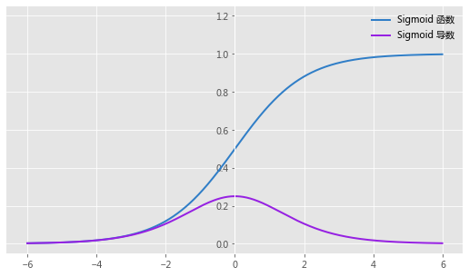

# Why Classification Tasks Use CrossEntropy Instead of MSE

---
&emsp;&emsp;通常，我们使用MSE作为回归任务的损失函数，使用CE作为分类任务的损失函数，对于很多问题回归与分类可以相互转化。（逻辑回归：分类任务回归化；回归问题分类化：年龄预测问题-->年龄段分类问题）具体可见：[知乎： 回归与分类的区别](https://www.zhihu.com/question/21329754) 。那么为什么分类任务不可以用MSE作为损失函数呢？

&emsp;&emsp;通常回归问题的模型输出是整个实数域$(-\infty,+\infty)$，而分类任务常常需要将输出映射到$[0, 1]$的区间上，即赋予其概率意义（这类映射函数都具有饱和性）。

&emsp;&emsp;**从优化的角度来看：**

&emsp;&emsp;我们考虑一个二分类问题，模型输出$f(x)$，sigmoid函数$y=\frac{1}{1+e^{-f(x)}}$。我们接下来考虑反向传播，求导数。

&emsp;&emsp;我们考虑sigmoid函数与其导数：
$$
f(x) = \frac{1}{1+e^{-x}} \\
\begin{align}
\frac{\partial f}{\partial x} &= - \frac{1}{(1+e^{-x})^2} \cdot - e^{-x} \\
							  &= \frac{e^{-x}}{(1+e^{-x})^2} \\
							  &= \frac{1}{1+e^{-x}} \cdot \frac{e^{-x}}{1+e^{-x}} \\
							  &= f(x)\cdot(1-f(x))
\end{align}
$$

&emsp;&emsp;函数图像如下：

&emsp;&emsp;从图中可以看出，sigmoid函数两侧很大范围内梯度都是0，如果我们把一个类别为1的数据错判为0，由于sigmoid函数梯度为0，造成网络梯度消失，很难训练。softmax是sigmoid的扩充，对于多类别下使用softmax会有同样的问题。

&emsp;&emsp;**从概率的角度来看：MSE实际上是高斯分布的极大似然，即认为误差服从高斯分布，从贝叶斯角度来看即引入高斯先验；CrossEntropy是多项式分布（或伯努利分布）的极大似然，分类问题当然是多项式分布。**

&emsp;&emsp;多项式分布是二项分布的推广，在多项式分布之前，先来介绍二项分布与伯努利分布。

&emsp;&emsp;**伯努利分布(Bernoulli)**

&emsp;&emsp;伯努利分布是关于布尔变量 $x \in \{0,1\}$ 的概率分布，其连续参数 $p \in [0,1]$ 表示变量 $x=1$ 的概率。伯努利概率分布函数写作：

$$
P(x|p)=p^x \ (1-p)^{1-x}
$$

&emsp;&emsp;直观理解即扔一次硬币，硬币要么正面要么背面。

&emsp;&emsp;**二项分布(Binomial)**

&emsp;&emsp;二项分布即重复 $n$ 次独立的伯努利试验。在 $n$ 次独立重复的伯努利试验中，假设每次试验中事件 $A$ 发生的概率为 $p$ ，用 $X$ 表示 $n$ 重伯努利试验中事件 $A$ 发生的次数，则 $X$ 取值范围为 $0, 1, ..., n$ 。且对每一个$k(0 \leq k \leq n)$ ，事件{$X=k$}表示“$n$次试验中事件$A$恰好发生$k$次” 。随机变量$X$的离散概率分布即为二项分布。

&emsp;&emsp;一般地，如果随机变量 $X$ 服从参数为 $n$ 和 $p$ 的二项分布，我们记为 $X \sim B(n,p)$ 或 $X \sim b(n,p)$。 其离散概率分布为：

$$
\begin{align}
P(X=k|n,p)=&C_n^k\ p^k\ (1-p)^{n-k} \\
P(X=k|n,p)=&\left(^n_k  \right)p^k\ (1-p)^{n-k}
\end{align}
$$

&emsp;&emsp;直观理解即一枚硬币扔 $n$ 次，扔出正面的概率为 $p$ ，其中 $k$ 次正面的概率。

&emsp;&emsp;**多项分布(Multinomial Distribution)**

&emsp;&emsp;多项式分布是二项分布的推广，二项分布可以理解为抛一枚正面朝上概率为 $p$ 的硬币 $n$ 次，其中正面朝上 $k$ 次的概率分布。那么多项式分布就可以理解为把二项分布中的抛掷硬币改成抛掷骰子。

$$
p(X_1=m_1,X_2=m_2,...,X_k=m_K|\theta _1, \theta _2, ..., \theta _K, n)=\frac{n!}{m_1!m_2!...m_K!}\theta _1^{m_1}\theta _2^{m_2}...\theta _K^{m_K}
$$

$$
\sum_{k=1}^K\theta _k = 1
$$

$$
\sum_{k=1}^Km_k = n
$$

&emsp;&emsp;多项式分布描述的是，一个事件有 $k$ 种结果，$\{x_1,x_2,...,x_k\}$，对应事件发生的概率为$\{\theta _1,\theta _2,...,\theta _k\}$，试验 $n$ 次，每种结果发生了$\{m_1,m_2,...,m_k\}$次。为了更直观，假设我们有一个灌铅骰子，我们定义随机变量 $X$ 为这个骰子朝上的点数，则 $X$ 可取 $1，2，3，4，5，6$ 。而概率依次为为$P(X=1)= \theta _1,P(X=2)= \theta _2,P(X=3)= \theta _3,P(X=4)= \theta _4,P(X=5)= \theta _5,P(X=6)= \theta _6$，我们重复抛掷这个骰子 $n$ 次，结果一点朝上共$m_1$次，二点朝上共$m_2$次，三点朝上$m_3$次，....的概率即为公式$8$ 描述的事情。

> &emsp;&emsp;在理解该公式之前，我们了解一下“多项式”：
> 
> $$
> (x_1+x_2+...+x_k)^n=\sum \frac{n!}{r_1!r_2!...r_k!}x_1^{r_1}x_2^{r_2}...x_k^{r_k}
> $$
>
> $$
> \begin{align}
> (x_1+x_2+...+x_K)^n&=\underbrace {(x_1+x_2+...+x_K)...(x_1+x_2+...+x_K)} _{n} \\
>                    &=\sum_{r_1,r_2,...,r_K}^{n} C_n^{r_1}C_{n-r_1}^{r_2}C_{n-r_1-r_2}^{r_3}...x_1^{r_1}x_2^{r_2}...x_K^{r_K} \\
>                    &=\sum_{r_1,r_2,...,r_K}^{n}  \left( \frac{n!}{(n-r_1)!} \frac{1}{r_1!}\right) \cdot \left( \frac{(n-r_1)!}{(n-r_1-r_2)!}\frac{1}{r_2!}\right) \cdot...\cdot \left( \frac{{(n-r_1-..-r_{k-1})}!}{(n-r_1-..-r_{K-1}-r_K)!}\frac{1}{r_K!} \right) \cdot x_1^{r_1}x_2^{r_2}...x_K^{r_K}   \\
>                    &=\sum_{r_1,r_2,...,r_K}^{n}  \frac{1}{r_1!} \frac{1}{r_2!} \cdot \cdot \cdot \frac{1}{r_K!} \cdot \frac{n!}{(n-r_1-..-r_{K-1}-r_K)!}\cdot x_1^{r_1}x_2^{r_2}...x_K^{r_K}  \\
>                    & \because \sum_i^K r_i = n \\
>                原式&=\sum_{r_1,r_2,...,r_K}^{n}  \frac{1}{r_1!} \frac{1}{r_2!} \cdot \cdot \cdot \frac{1}{r_K!} \cdot \frac{n!}{0!}\cdot x_1^{r_1}x_2^{r_2}...x_K^{r_K}  \\
>                    &=\sum_{r_1,r_2,...,r_K}^{n} \frac{n!}{r_1!r_2!...r_K!}x^{r_1}x^{r_2}...x^{r_K}
> \end{align}
> $$
>
> &emsp;&emsp;可以看出多项式分布的“多项式”名字的来源。把上面多项式中的$x_i$ 换成$\theta_i$，就可以发现多项式分布的离散概率分布即多项式展开式中的一个子项。多项式展开式的子项，描述多项式相乘时，每一次只能取括号中的一个项，一共取$n$次，前面的系数即有多少种取法。

&emsp;&emsp;我们考虑多项式分布 **$\theta$** 的对数似然函数:

$$
\mathcal{L}(\theta)=\frac{n!}{m_1!m_2!...m_K!}\theta _1^{m_1}\theta _2^{m_2}...\theta _K^{m_K} 
$$

$$
\begin{align}
\theta ^*&=arg\max _\theta \ log(\mathcal{L}(\theta)) \\
         &=arg\max _\theta\left[log(\frac{n!}{m_1!m_2!...m_K!}) + m_1\cdot log(\theta_1)+m_2\cdot log(\theta_2)  + ...+ m_K\cdot log(\theta_K)\right] \\
         &=arg\max_\theta \left[log(\frac{n!}{m_1!m_2!...m_K!}) +\sum_i^K m_ilog(\theta _i)\right] \\
         &=arg\max_\theta \sum_i^K m_ilog(\theta _i) \\
         & s.t. \sum_i^K\theta_i=1
\end{align}
$$

&emsp;&emsp;我们回顾交叉熵：
$$
\mathcal{Loss}=\sum_i^K -y_ilog(p_ {\theta _i}(x))
$$

&emsp;&emsp;由于$y_i$考虑为概率，给交叉熵右侧乘一个$N$ 结果与多项式分布的极大似然估计一致。

&emsp;&emsp;分类任务使用交叉熵作为$\mathcal{Loss}$对模型参数进行训练与对多项式分布做极大似然是一样的。

&emsp;&emsp;那我们再看一下高斯分布：

$$
p(x) \sim \mathcal{N}(\mu,\sigma) \\
P(X=x)=\frac{1}{\sqrt{(2\pi)\cdot\sigma^2}}\cdot exp\{-\frac{(x-\mu)^2}{2\sigma^2}\}
$$

&emsp;&emsp;最大似然函数有：
$$
\mathcal{L}(\theta)=\frac{1}{\sqrt{(2\pi)\cdot\sigma^2}}\cdot exp\{-\frac{(x-\mu)^2}{2\sigma^2}\} \\
\begin{align}
\theta ^*&=arg\max _\theta \ log(\mathcal{L}(\theta)) \\
         &=arg\max _\theta\left[-\frac{1}{2}log(2\pi\cdot \sigma^2) -\frac{(x-\mu)^2}{2\sigma^2}\right] \\
         &=arg\max_\theta -\frac{(x-\mu)^2}{2\sigma^2}\\
&(\theta=[\mu, \sigma]^T)
\end{align}
$$

&emsp;&emsp;我们假设一共 $K$ 类，$\hat{y}(x)\in \mathbb{R}^K$ 为模型输出概率，各维度元素均服从高斯分布且相互独立,，$y\in \mathbb{R}^K$ 为真实值。那么MSE又发生了什么？MSE：均方误差

$$
MSE=\frac{\sum_{x}||\hat{y}(x)-y||^2}{2n}
$$

&emsp;&emsp;其中 $y$ 为真实值，$\hat{y}(x)$ 为模型预测值。

&emsp;&emsp;可以看出最后一项等价于MSE损失函数。分类任务使用MSE作为$\mathcal{Loss}$对模型参数进行训练与对高思分布做极大似然是一样的。

&emsp;&emsp;题外话：对于回归问题，从贝叶斯角度来看，我们的数据是理论数据加噪声得来的，在没有任何先验的情况下，引入高斯先验是没有问题的。

### Ref
---
*  [最大似然估计，MSE Loss和高斯分布](https://zhuanlan.zhihu.com/p/258961357) 

* [从最大似然估计理解交叉熵Loss](https://zhuanlan.zhihu.com/p/145967829)

* [为什么二分类不用MSE损失函数](https://jishuin.proginn.com/p/763bfbd2bbb3)

* [机器学习面试之MSE与CE的区别？](https://www.jianshu.com/p/5d13bcd9d990)