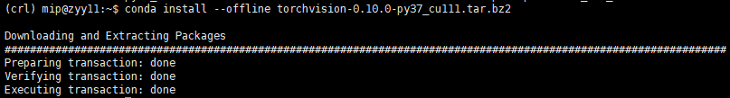

## 离线配置环境

**存在一服务器连接不到外网，但可以通过内网传输文件，如何通过anaconda 配置虚拟环境？**（使我有洛阳二顷良田，安能佩六国相印？）

1. 从能联网的电脑下载Anaconda3 
	[Anaconda3-5.3.1-Linux-x86_64.sh](https://www.anaconda.com/products/individual#Downloads) 注意下载相应OS的Anaconda3
2. winscp传输到服务器
3. `bash Anaconda3-5.3.1-Linux-x86_64.sh` 进行安装（后续配置环境变量自行解决）
4. `source activate base` 进入虚拟环境
5. `conda create -n myenv --clone base` 通过克隆base环境，创建新的虚拟环境
6. https://anaconda.org/pytorch-lts/pytorch/files 下载相关第三方的tar.bz2压缩包
7. winscp传输到服务器

6. `conda install --offline torchvision-0.10.0-py3.7_cu111.tar.bz2` 进行安装

7. pytorch 同理（注意Conda的Python版本、CUDA版本、pytorch/torchvision版本）

