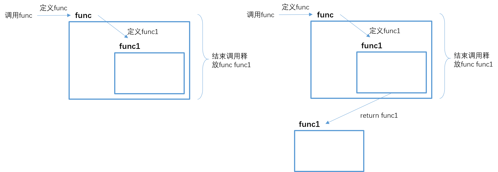

### 闭包

---

&emsp;&emsp;consider：

```python
def func():# 外部函数
    print("This is func.")
    def func1():# 内部函数
        print("This is func1.")
        
# 我们直接调用func1会报错：
func1()

'''
Traceback (most recent call last):
	NameError: name 'func1' is not defined
'''
```

&emsp;&emsp;编译器告诉我`func1`函数没有被定义，那我们尝试下这么做呢？

```python
def func():# 外部函数
    print("This is func.")
    def func1():# 内部函数
        print("This is func1.")

# 我们先调用func()函数，func()函数定义func1()函数
func()
func1()

'''
This is func.
Traceback (most recent call last):
	NameError: name 'func1' is not defined
'''
```

&emsp;&emsp;依然报错`func1`函数没有定义，为什么。

&emsp;&emsp;**函数内的属性/函数都是有生命周期的，只有在函数执行/函数被调用时存活。** 

&emsp;&emsp;那如果我们依然想在外部使用内部函数？

```python
def func():# 外部函数
    print("This is func.")
    def func1():# 内部函数
        print("This is func1.")
	return func1

f = func() 
f()

'''
This is func.
This is func1.
'''
```
&emsp;&emsp;another e.g.
```python
def func():# 外部函数
    a = 1# 外部函数作用域里的变量
    print('This is func.')
    def func1(num):# 内部函数
        print('This is func1.')
        print(num + a)
    return func1

f = func()
f(2)
print(a)
'''
This is func.
This is func1.
3
Traceback (most recent call last):
	NameError: name 'a' is not defined
'''
```

&emsp;&emsp;闭包：内部函数对外部函数作用域里变量的引用。闭包内的内部函数私有化了外部函数的变量，完成数据封装。

<div align=center></div>


### 装饰器

---

&emsp;&emsp;装饰器也是一个函数，它是让其他函数在不改变变动的前提下增加额外的功能。
&emsp;&emsp;装饰器是一个闭包，把一个函数当作参数返回一个替代版的函数，本质是一个返回函数的函数（即返回值为函数对象）。函数被装饰器装饰过后，此函数的属性均已发生变化，如名称变为装饰器的名称。
&emsp;&emsp;python3支持用@语法糖直接将装饰器应用到函数。


```python
@func1
def func():
    print('Hello World.')
```

装饰器不应该影响函数本身的作用。

```python
def func1(func):# 外部闭包函数的参数是要被装饰的函数对象
    def func2():
        print('doing func2.')
        return func()
    
@func1    
def myprint():
    print('Hello, This is a Print func')
    
myprint()

'''
doing func2.
Hello, This is a Print func
'''
```


### Ref

---

* [Python装饰器](https://www.bilibili.com/video/BV11s411V7Dt?from=search&seid=1189062999494457225) 
* []()

