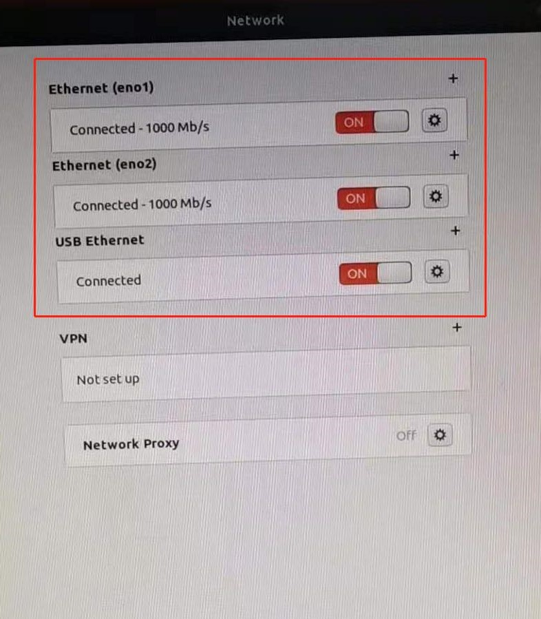
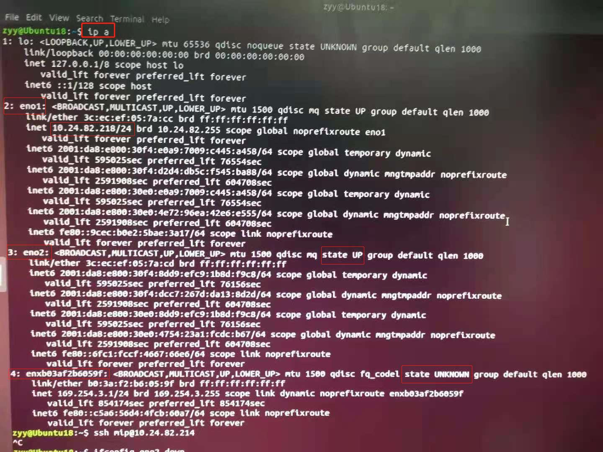
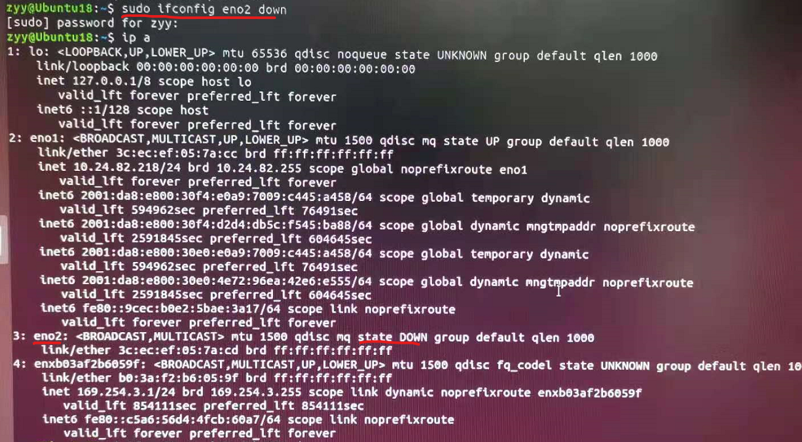
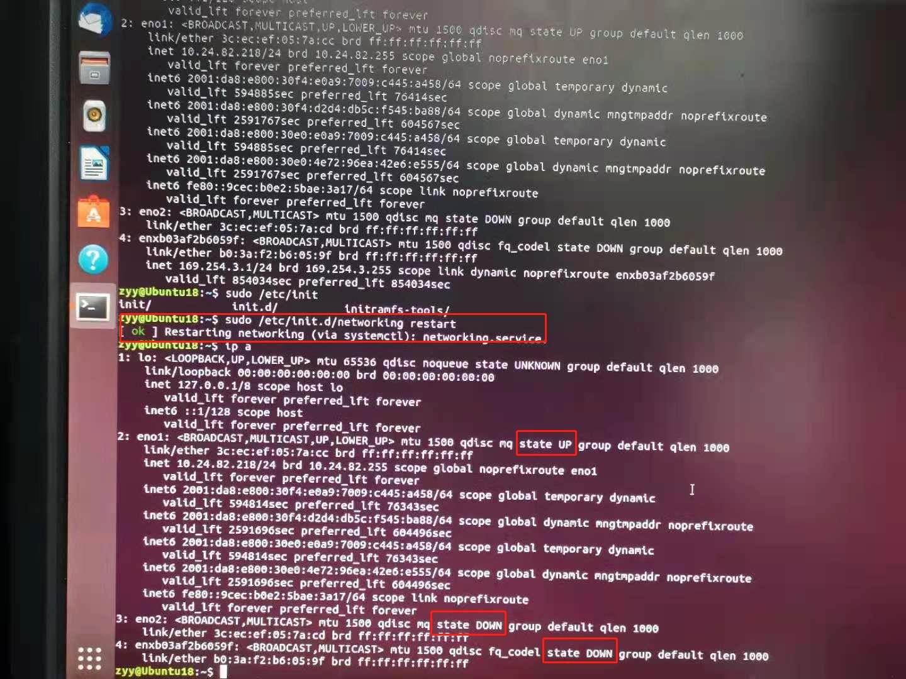
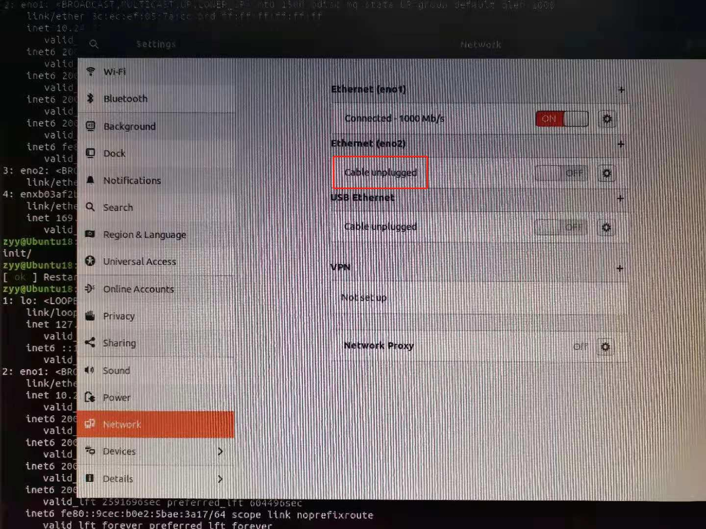

新服务器插了三根网线，两根正常以太，一根BMC以太



配置eno1网口静态ip、DNS、网关掩码等。


Apply之后  开关eno1网口（手动重启），并关闭下面两个网口。

后续配置系统显卡驱动，配置完成之后系统重启，开始连接不上服务器，症状：Xshell连接不上，显示Connect failed，连上之后过不了多久掉线退出，报错：


去机房重新检查服务器，发现由于重启系统，下面两个之前关闭的网口启用，下面两个是动态ip，没有配置静态ip。为防止将来重启系统又发生上述问题：

将下面两个网口禁用 REF: [Linux 中如何启用和禁用网卡？](https://zhuanlan.zhihu.com/p/65480107)

`ip a` 命令查看网口



`ifconfig 网口名 down` 命令关闭网口



同理关闭enxb03af2b6059f网口

重启网络服务：



再次查看setting：



`ifconfig xxx down` 只是单次关闭网口，重启系统依然出现上述情况。（）


进入 `sudo vim /etc/network/interfaces`

原文件（修改前）：

```
# # interfaces(5) file used by ifup(8) and ifdown(8)
# auto lo
# iface lo inet loopback
```

修改为：

```
# interfaces(5) file used by ifup(8) and ifdown(8)
auto lo
iface lo inet loopback
# 下面这行就是禁用了eno2。wlo1可以替换成任意你想禁用的网卡。重复多行可以禁用多个不同的网卡
iface eno2 inet manaual
iface enxb03af2b6059 inet manaual
```

